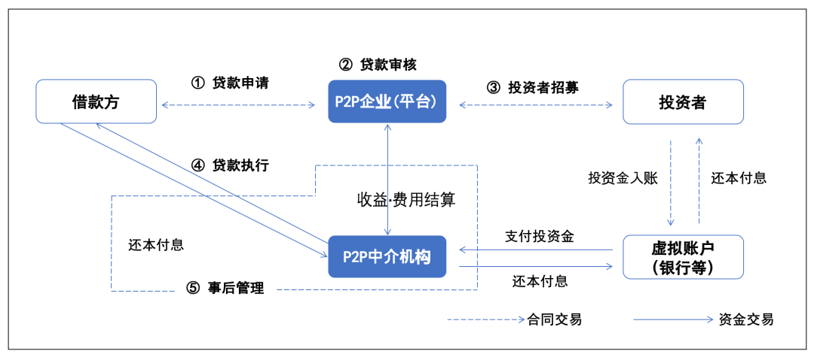
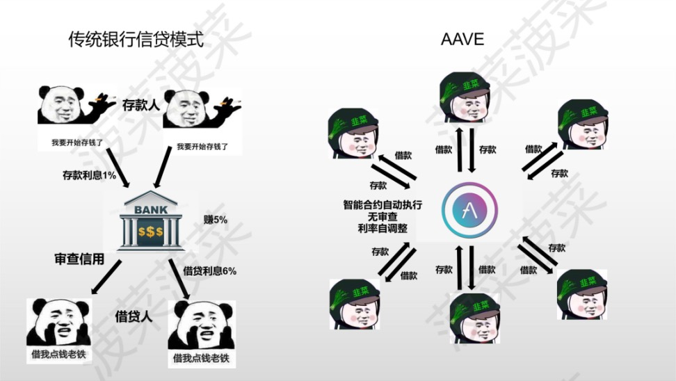

# AAVE借贷协议概述

## ETHLend

* `ETHLend`
  * AAVE前身是ETHLend
    * ETHLend = ETH Lend = 以太币的借贷
  * 发展历史
    * 于2017年由早期加密货币采纳者Stani Kulechov创立，最初推出的名称是ETHLend (LEND)，以应对缺乏基于以太坊网络的借贷应用
    * 2018年9月，ETHLend更名为Aave
  * 主要模式：P2P借贷
    * P2P贷款业务结构
      * 
  * P2P托管借贷存在的问题 
    * P2P借贷是通过在线平台将贷款方（lender）和借款方（borrower）联系起来，以便难以从金融机构获得贷款的个人或公司通过中间利率（约8–12％）来获得贷款。另一方面，韩国不少用户把P2P贷款借贷服务称为“众筹型贷款”。换句话来讲，从个人那里收集的资金为对个人，公司和项目提供贷款服务，其偿还的本金和利息重新分配给投资者的商业模型。因此，P2P贷方主要负责1）代表投资者直接对借款方进行信用评估并厘定贷款协议，2）委托管理客户资产（贷款，抵押品等）

## AAVE

* `AAVE`
  * Logo
    * 
  * 中文：`阿夫`
  * 名称含义
    * Aave在芬兰语中是“鬼”的意思 
      * 为了强调该协议的理念：在DeFi段中建立一个清晰开放的生态系统 
      * 所以Logo是鬼=幽灵的图案 
  * 是什么 
    * DeFi借贷平台
      * DeFi领域中一种借贷协议=一个借贷平台
    * 一种允许用户借入加密资产并从存款中获利的开源协议 
    * 一个去中心化的非托管流动性市场协议 
    * 一个非托管的DeFi协议 
      * 在去中心化的环境中为客户提供一系列金融服务 
  * 综述 
    * 3.AAVE 
    * 项目类型：借贷 
    * 支持公链：以太坊生态的 7 条公链 
    * TVL：39 亿美元 
    * 项目定位：基于以太坊生态的去中心化借贷平台 
    * 项目优势：创新性地设置了安全模块，增强了资金安全性 
    * 运作机制：Aave 是一个多链借贷协议，用户可以通过存款赚取收益，也可以存入支持的抵押物并借入其它资产。协议收取一部分利息收入，用于维持 DAO 并支持协议贡献者。收取的比例由储备系数决定，根据资产风险的不同，储备系数在 10%～35% 之间 
  * 概述 
    * Aave是一个去中心化的非托管流动性市场协议，用户可以作为供应商或借款人参与其中。供应商向市场提供流动性以赚取被动收入，而借款人能够以过度抵押(永久)或抵押不足(一次性流动性)的方式借款 
      * 
  * 最大特点 
    * 闪电贷 
    * 多代币支持 
    * 无抵押借贷 
  * 发展情况 
    * AAVE已集成到其他平台、钱包等 
      * My Ether Wallet 
      * DeFi Saver 
      * Idle Finance 
      * Zerion 
      * Trustwallet 
  * 安全模块 
    * （1）用户可以将他们的代币质押在安全模块（SM），以提供可用于保护协议的资金，相应地他们也可以获得由生态系统储备基金发出的 AAVE 代币奖励。 
    * （2）安全模块可以保护协议免受资金短缺事件的影响。当智能合约风险、预言机故障和清算风险导致资金意外损失时，可能会发生资金短缺事件。在这种情况下，安全模块最多可以使用资金的 30% 来维持协议的稳定。 
    * （3）安全模块中质押的资金让 AAVE 代币的持有者能够捕获协议的价值，并能够提供链上交易所需的流动性，又让普通用户的资金更加安全。协议允许额外铸造 AAVE 代币，并通过拍卖来偿还债务，让协议的正常运行多了一重保险。 
  * 代币 
    * ETHLend的：LEND
    * aave 
      * 代币：AAVE 
        * 属于：Aave 
        * 概述：Aave通过改进提案(AP1)，在2020年10月3日(区块高度10978863)将Aave平台代币LEND以100:1的比例转换为AAVE。Aave是一个开源的去中心化借贷协议，为用户提供存款和借贷服务。借贷双方用户的存款利率与贷款利率是根据平台借款量和存款量通过算法来计算得到的，并且平台采用Chainlink的预言机来保证抵押物价格的公平性。 
      * 衍生代币=协议代币：aToken
      * 稳定币：GHO 
  * 路线图=发展历史 
    * 2017年11月 
      * ETHLend在ICO中募集了1600万美元。这笔资金被用来创建一个去中心化的点对点借贷平台。 
    * 2018年9月 
      * 一家新的母公司，Aave，宣布将取代ETHLend。 
    * 2019年10月 
      * Aave V1公共测试网正式上线。 
    * 2020年1月 
      * Aave V1上线。ETHLend停止运作。 
    * 2020年10月 
      * 发行AAVE加密代币（以1:100的比例从旧代币LEND迁移到AAVE）。 
    * 2020年12月 
      * AAVE V2上线，它包含几个新功能，而Aave V1继续运行。 
    * 2021年7月 
      * Aave计划中的机构型DeFi产品Aave Pro被改名为Aave Arc。原因是要把它的功能描绘成机构进入去中心化金融领域的门槛 
