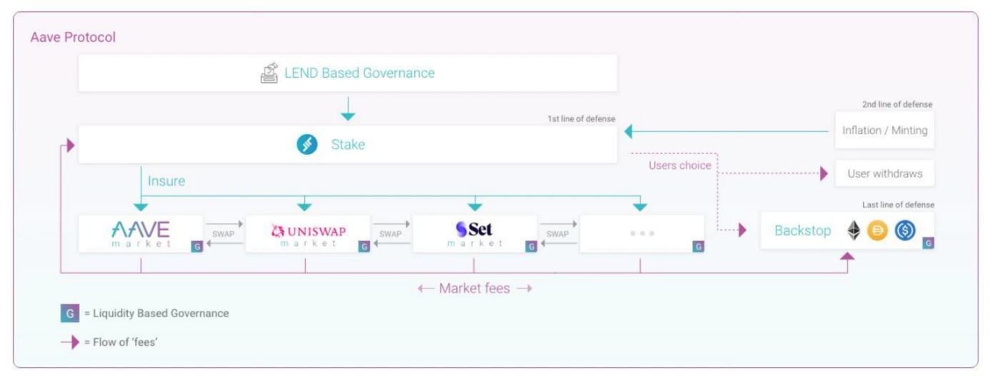
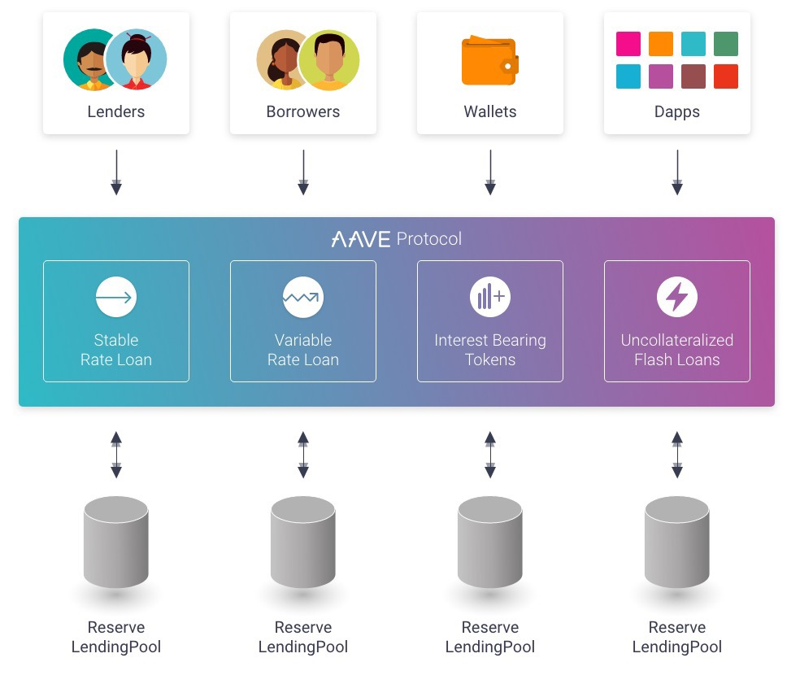
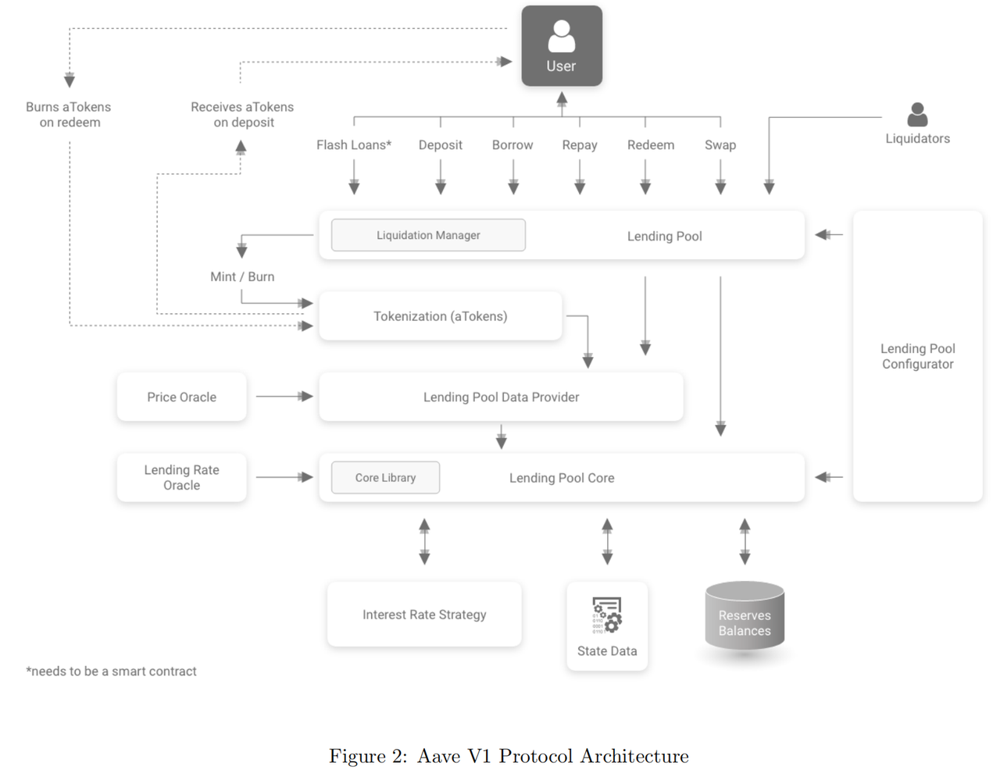
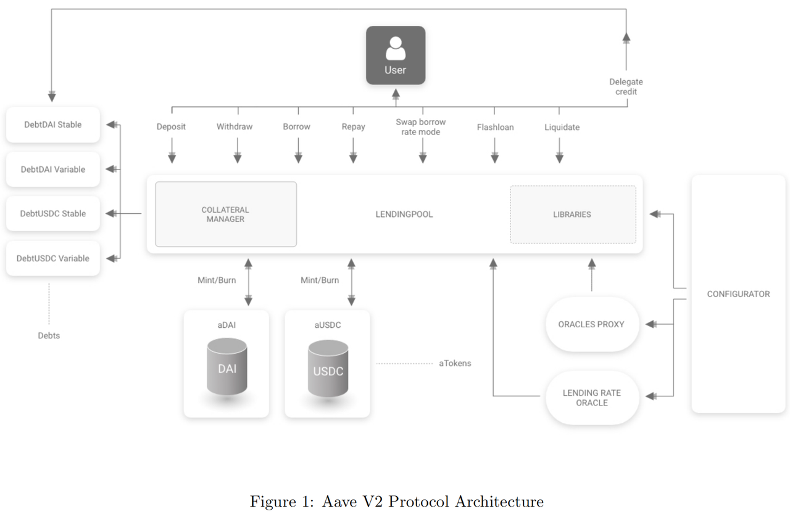
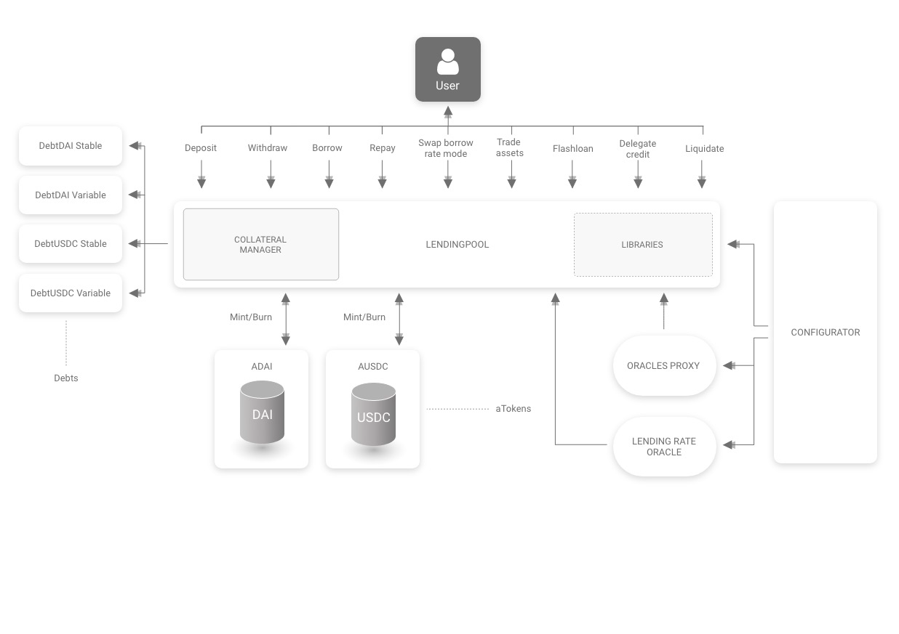
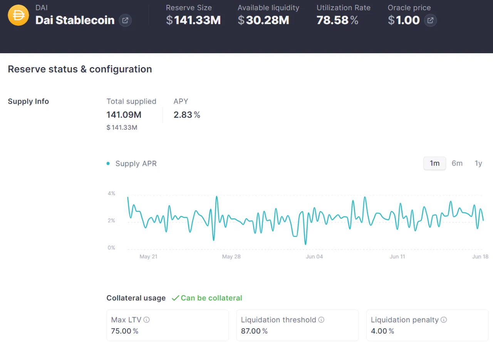

# 核心逻辑和架构

* AAVE借贷协议
  * 协议版本 
    * AAVE v1 
      * 详见：AAVE V1
    * AAVE v2 
      * 详见：AAVE V2
    * AAVE v3 
      * 详见：AAVE V3
  * 核心内容
    * ETHLend
      * 
    * AAVE V2
      * 
  * 协议架构Protocol Architecture
    * AAVE v1
      * 
    * AAVE V2 
      * 
      * 
    * 对比
      * V2和V1架构图的核心区别 
        * 1. 以前存储在LendingPoolCore合约中的资金现在存储在每个特定的attoken中 
          * 这使得协议在资产之间更好地隔离，这有利于实现可感知产量的attoken。 
        * 2. LendingPoolCore和LendingPoolDataProvider已被删除并替换为库。这在优化代码复杂性和冗长性的同时，将所有操作的气体足迹减少了15%到20%。 
        * 3. 现在所有的动作都通过LendingPool进行;在每个token上替换以前需要的redeem()。 
        * 4. 债务代币跟踪用户债务 
  * 核心流程 
    * 关键词=核心动作=核心事件 
      * 包括 
        * deposit=存入 
        * redeem == withdraw=取回 
        * borrow=借出 
        * repay=偿还 
        * swap = Rate swap == Swap borrow rate mode = 利率调整 = 切换借贷利率模型 
        * liquidation=清算 
        * 其他特殊 
          * flash loan=闪电贷 
      * 对应合约中的函数 
        * LendingPool 
          * deposit() 
          * withdraw() 
          * borrow() 
          * repay() 
          * swapBorrowRateMode() 
          * setUserUseReserveAsCollateral() 
          * flashloan() 
          * liquidationCall() 
      * 主要逻辑、关系、顺序 
        * 先存款deposit -> 后赎回redeem==withdraw 
        * 先借款borrow -> 后偿还repay / 或清算liquidation 
          * 根据需要，去切换借贷利率模型Swap borrow rate mode ？ 
    * AAVE借贷流程 流程 
      * 概述 
        * LendingPool合约中实现的高级功能之一是贷款头寸的标记化。当用户存入特定的准备金时，他会收到相应数量的aTokens，这些token映射了所存入的流动性，并积累了所存入的基础资产的利息。代币是在存款时铸造的，它们的价值会增加，直到它们在赎回或清算时被烧毁。每当用户打开借贷头寸时，用作抵押品的代币被锁定，无法转让。 
          * One of the advanced features implemented in the LendingPool contract is the tokenization of the lending position. When a user deposits in a specific reserve, he receives a corresponding amount of aTokens, tokens that map the liquidity deposited and accrue the interests of the deposited underlying assets. Atokens are minted upon deposit, their value increases until they are burned on redeem or liquidated. Whenever a user opens a borrow position, the tokens used as collateral are locked and cannot be transferred. 
      * 详解 
        * 首先，用户在 Aave 存入资金时，协议会铸造与标的资产 1:1 数量的 aTokens 代币，该代币符合 ERC20 标准，可以转移或进行交易。另外，存款利息的发放体现在 aToken 的余额上，即用户的 aToken 余额会随着时间的推移而增长 
        * 其次，用户存入资产进行抵押后，即可在协议借出一定比例的资产，一般为超额抵押借贷；在借款时，用户可以选择固定利率或浮动利率两种模式。另外，根据不同代币的风险情况，每个代币的最大可借出资产价值（LTV）都不一样。如图 ，DAI 的 LTV 为 75%，即抵押 1 个 DAI 可借出对应 0.75 个 DAI 价值的资产 
          * 
        * 最后，用户在协议上进行偿还借出资产，并需要支付利息，利息由每个资产的利用率及市场的供需情况决定。若抵押资产的价格下跌，导致抵押品价值与借出资产价值的比例低于清算阈值时，用户将面临清算；清算过程依赖于预言机的喂价，Aave 协议使用的是 Chainlink。当用户完成偿还操作后，即可取回抵押资产，同时协议销毁对应的 aTokens 