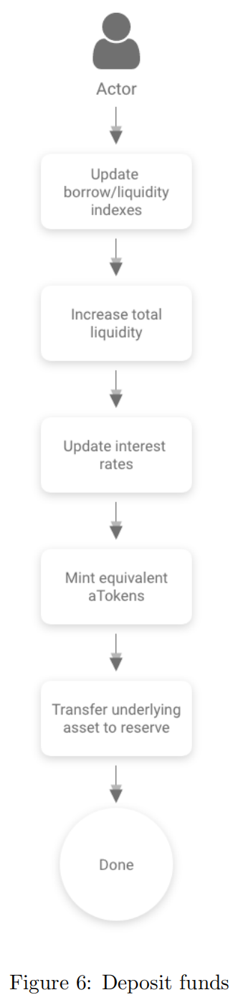

# 借贷逻辑

* deposit = 存款 
  * 逻辑
    * 用户通过deposit函数向协议存款时，可以选择ERC20token资产或者ETH，不可以两者混用，如果是ETH的话那么reserve地址就是0xEEEE…EEEE。主要逻辑就是调用core合约的更新储备状态函数，而后mint出一笔新的atoken作为用户的资产凭证，随后通过core合约向储备地址转款。其中referralCode只在最后的emit事件时使用，用于判断用户是否会接受奖励 
  * 流程
    * 
  * 代码 
    ```js
        /** 
        * @dev deposits The underlying asset into the reserve. A corresponding amount of the overlying asset (aTokens) 
        * is minted. 
        * @param _reserve the address of the reserve 
        * @param _amount the amount to be deposited 
        * @param _referralCode integrators are assigned a referral code and can potentially receive rewards. 
        **/ 
        function deposit(address _reserve, uint256 _amount, uint16 _referralCode) 
            external 
            payable 
            nonReentrant 
            onlyActiveReserve(_reserve) 
            onlyUnfreezedReserve(_reserve) 
            onlyAmountGreaterThanZero(_amount) 
        { 
            AToken aToken = AToken(core.getReserveATokenAddress(_reserve)); 

            bool isFirstDeposit = aToken.balanceOf(msg.sender) == 0; 

            core.updateStateOnDeposit(_reserve, msg.sender, _amount, isFirstDeposit); 

            //minting AToken to user 1:1 with the specific exchange rate 
            aToken.mintOnDeposit(msg.sender, _amount); 

            //transfer to the core contract 
            core.transferToReserve.value(msg.value)(_reserve, msg.sender, _amount); 

            //solium-disable-next-line 
            emit Deposit(_reserve, msg.sender, _amount, _referralCode, block.timestamp); 
        }    
    ```
