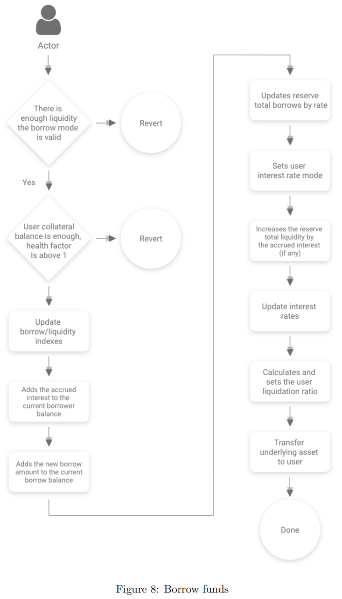

# borrow=借款

* borrow= 借款 = 借贷 
  * 说明 
    * 借款行为，以剩余的抵押品锁着为前提，将一定数量的标的资产转移给用户 
  * 流程 
    * 
  * 逻辑 
    * 对于借款的逻辑，为了缩减局部变量，使用了一个结构体来当作局部的用户全局信息。首先会检查用户借贷的目标储备是否允许借贷，确定借款利率模式以及有没有足够的储备金。随后计算当前发起借款用户的抵押资金、借贷总额、总手续费、当前LTV、清算阈值以及健康因子。当上述条件都满足后会计算当前借款的必须抵押资金，只有抵押金额大于借款额后才会调用core合约执行转账逻辑，将借出款从储备中转给用户。 
  * 代码 
    ```js
    /** 
    * @dev data structures for local computations in the borrow() method. 
    */ 
    struct BorrowLocalVars { 
        uint256 principalBorrowBalance; 
        uint256 currentLtv; 
        uint256 currentLiquidationThreshold; 
        uint256 borrowFee; 
        uint256 requestedBorrowAmountETH; 
        uint256 amountOfCollateralNeededETH; 
        uint256 userCollateralBalanceETH; 
        uint256 userBorrowBalanceETH; 
        uint256 userTotalFeesETH; 
        uint256 borrowBalanceIncrease; 
        uint256 currentReserveStableRate; 
        uint256 availableLiquidity; 
        uint256 reserveDecimals; 
        uint256 finalUserBorrowRate; 
        CoreLibrary.InterestRateMode rateMode; 
        bool healthFactorBelowThreshold; 
    } 

    /** 
    * @dev Allows users to borrow a specific amount of the reserve currency, provided that the borrower 
    * already deposited enough collateral. 
    * @param _reserve the address of the reserve 
    * @param _amount the amount to be borrowed 
    * @param _interestRateMode the interest rate mode at which the user wants to borrow. Can be 0 (STABLE) or 1 (VARIABLE) 
    **/ 
    function borrow( 
        address _reserve, 
        uint256 _amount, 
        uint256 _interestRateMode, 
        uint16 _referralCode 
    ) 
        external 
        nonReentrant 
        onlyActiveReserve(_reserve) 
        onlyUnfreezedReserve(_reserve) 
        onlyAmountGreaterThanZero(_amount) 
    { 
        // Usage of a memory struct of vars to avoid "Stack too deep" errors due to local variables 
        BorrowLocalVars memory vars; 

        //check that the reserve is enabled for borrowing 
        require(core.isReserveBorrowingEnabled(_reserve), "Reserve is not enabled for borrowing"); 
        //validate interest rate mode 
        require( 
            uint256(CoreLibrary.InterestRateMode.VARIABLE) == _interestRateMode || 
                uint256(CoreLibrary.InterestRateMode.STABLE) == _interestRateMode, 
            "Invalid interest rate mode selected" 
        ); 

        //cast the rateMode to coreLibrary.interestRateMode 
        vars.rateMode = CoreLibrary.InterestRateMode(_interestRateMode); 

        //check that the amount is available in the reserve 
        vars.availableLiquidity = core.getReserveAvailableLiquidity(_reserve); 

        require( 
            vars.availableLiquidity >= _amount, 
            "There is not enough liquidity available in the reserve" 
        ); 

        ( 
            , 
            vars.userCollateralBalanceETH, 
            vars.userBorrowBalanceETH, 
            vars.userTotalFeesETH, 
            vars.currentLtv, 
            vars.currentLiquidationThreshold, 
            , 
            vars.healthFactorBelowThreshold 
        ) = dataProvider.calculateUserGlobalData(msg.sender); 

        require(vars.userCollateralBalanceETH > 0, "The collateral balance is 0"); 

        require( 
            !vars.healthFactorBelowThreshold, 
            "The borrower can already be liquidated so he cannot borrow more" 
        ); 

        //calculating fees 
        vars.borrowFee = feeProvider.calculateLoanOriginationFee(msg.sender, _amount); 

        require(vars.borrowFee > 0, "The amount to borrow is too small"); 

        vars.amountOfCollateralNeededETH = dataProvider.calculateCollateralNeededInETH( 
            _reserve, 
            _amount, 
            vars.borrowFee, 
            vars.userBorrowBalanceETH, 
            vars.userTotalFeesETH, 
            vars.currentLtv 
        ); 

        require( 
            vars.amountOfCollateralNeededETH <= vars.userCollateralBalanceETH, 
            "There is not enough collateral to cover a new borrow" 
        ); 

        /** 
        * Following conditions need to be met if the user is borrowing at a stable rate: 
        * 1. Reserve must be enabled for stable rate borrowing 
        * 2. Users cannot borrow from the reserve if their collateral is (mostly) the same currency 
        *    they are borrowing, to prevent abuses. 
        * 3. Users will be able to borrow only a relatively small, configurable amount of the total 
        *    liquidity 
        **/ 

        if (vars.rateMode == CoreLibrary.InterestRateMode.STABLE) { 
            //check if the borrow mode is stable and if stable rate borrowing is enabled on this reserve 
            require( 
                core.isUserAllowedToBorrowAtStable(_reserve, msg.sender, _amount), 
                "User cannot borrow the selected amount with a stable rate" 
            ); 

            //calculate the max available loan size in stable rate mode as a percentage of the 
            //available liquidity 
            uint256 maxLoanPercent = parametersProvider.getMaxStableRateBorrowSizePercent(); 
            uint256 maxLoanSizeStable = vars.availableLiquidity.mul(maxLoanPercent).div(100); 

            require( 
                _amount <= maxLoanSizeStable, 
                "User is trying to borrow too much liquidity at a stable rate" 
            ); 
        } 

        //all conditions passed * borrow is accepted 
        (vars.finalUserBorrowRate, vars.borrowBalanceIncrease) = core.updateStateOnBorrow( 
            _reserve, 
            msg.sender, 
            _amount, 
            vars.borrowFee, 
            vars.rateMode 
        ); 

        //if we reached this point, we can transfer 
        core.transferToUser(_reserve, msg.sender, _amount); 

        emit Borrow( 
            _reserve, 
            msg.sender, 
            _amount, 
            _interestRateMode, 
            vars.finalUserBorrowRate, 
            vars.borrowFee, 
            vars.borrowBalanceIncrease, 
            _referralCode, 
            //solium-disable-next-line 
            block.timestamp 
        ); 
    }
    ```
