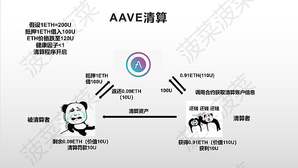
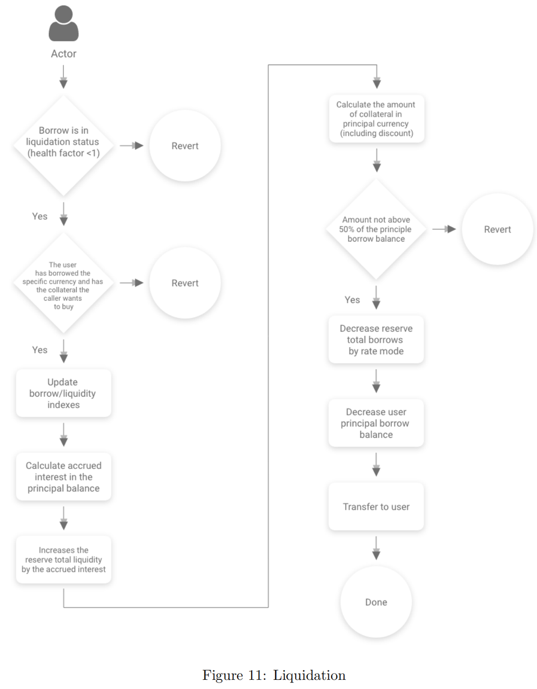

# liquidation=清算

* liquidation = 清算 
  * 说明 
    * 清算通知合约允许任何外部行为者以折扣价购买部分抵押品。如果发生清算事件，最多可以清算50%的贷款，这将使健康系数恢复到1以上。 
  * 清算逻辑
    * 
  * 清算流程图 
    * 
  * 逻辑 
    * 对于资不抵债需要清算的抵押资产，用户可以通过调用liquidationCall来进行资产清算，也就是购买清算资产，同时也会得到一些奖励。具体的逻辑是在liquidationManager中，详见liquidationManager小节 
  * 代码
    ```js
    /** 
    * @dev users can invoke this function to liquidate an undercollateralized position. 
    * @param _collateral the address of the collateral to liquidated 
    * @param _reserve the address of the principal reserve 
    * @param _user the address of the borrower 
    * @param _purchaseAmount the amount of principal that the liquidator wants to repay 
    * @param _receiveAToken true if the liquidators wants to receive the aTokens, false if 
    * he wants to receive the underlying asset directly 
    **/ 
    function liquidationCall( 
        address _collateral, 
        address _reserve, 
        address _user, 
        uint256 _purchaseAmount, 
        bool _receiveAToken 
    ) external payable nonReentrant onlyActiveReserve(_reserve) onlyActiveReserve(_collateral) { 
        address liquidationManager = addressesProvider.getLendingPoolLiquidationManager(); 

        //solium-disable-next-line 
        (bool success, bytes memory result) = liquidationManager.delegatecall( 
            abi.encodeWithSignature( 
                "liquidationCall(address,address,address,uint256,bool)", 
                _collateral, 
                _reserve, 
                _user, 
                _purchaseAmount, 
                _receiveAToken 
            ) 
        ); 
        require(success, "Liquidation call failed"); 

        (uint256 returnCode, string memory returnMessage) = abi.decode(result, (uint256, string)); 

        if (returnCode != 0) { 
            //error found 
            revert(string(abi.encodePacked("Liquidation failed: ", returnMessage))); 
        } 
    } 
    ```
