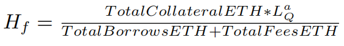
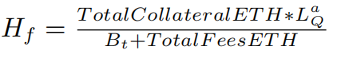
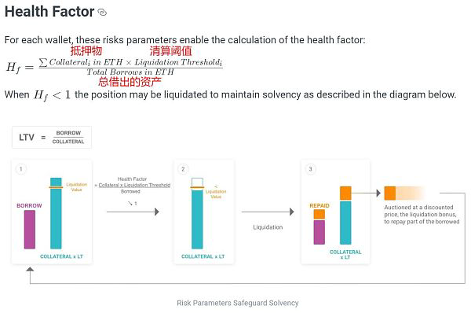

# 健康因子Health Factor

*  AAVE：健康因子=Health Factor=H(f)
  * 含义：用户的资金健康程度，如果健康因子小于1，就触发清算流程 
  * 评价：判断用户是否面临清算的一个重要指标 
  * 计算公式 
    * 图
      * 
      * 
      * 
    * 文字 
      * `H(f )=  (TotalCollateralETH ∗ L (a) (Q)) / (TotalBorrowsETH + TotalFeesETH) `
        * 当 `H(f)`<`1`，该笔贷款被视为是抵押不足，可以被清算 
          * when `Hf` < `1`, a loan is considered undercollateralized and can be liquidated 
