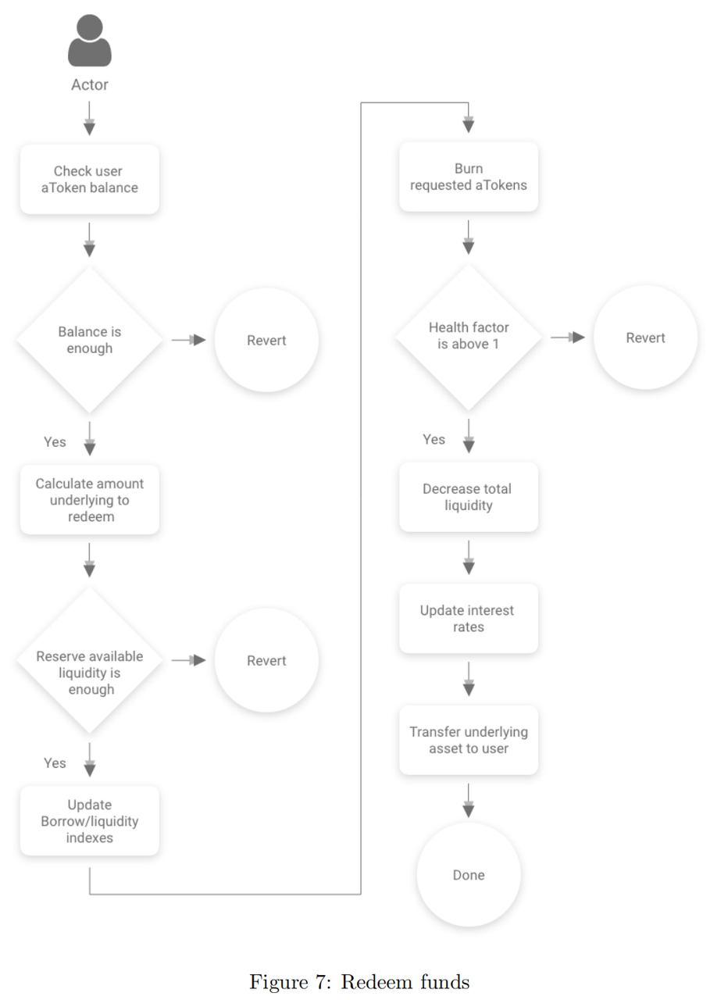

# redeem=赎回

* redeem = 赎回 
  * 说明 
    * 赎回操作允许用户将一定数量的attoken交换为基础资产 
    * 实际金额兑换是使用attoken / 基础汇率E(i)计算的 
  * 流程
    * 
  * 逻辑 
    * 用户可以通过redeemUnderlying来赎回标的资产，首先会判断储备中是否有足够的流动资金来满足用户的赎回操作，而后通过core合约的updateStateOnRedeem和transferToUser来完成更新储备信息和转款操作。 
  * 代码
    ```js
    /** 
    * @dev Redeems the underlying amount of assets requested by _user. 
    * This function is executed by the overlying aToken contract in response to a redeem action. 
    * @param _reserve the address of the reserve 
    * @param _user the address of the user performing the action 
    * @param _amount the underlying amount to be redeemed 
    **/ 
    function redeemUnderlying( 
        address _reserve, 
        address payable _user, 
        uint256 _amount, 
        uint256 _aTokenBalanceAfterRedeem 
    ) 
        external 
        nonReentrant 
        onlyOverlyingAToken(_reserve) 
        onlyActiveReserve(_reserve) 
        onlyAmountGreaterThanZero(_amount) 
    { 
        uint256 currentAvailableLiquidity = core.getReserveAvailableLiquidity(_reserve); 
        require( 
            currentAvailableLiquidity >= _amount, 
            "There is not enough liquidity available to redeem" 
        ); 

        core.updateStateOnRedeem(_reserve, _user, _amount, _aTokenBalanceAfterRedeem == 0); 

        core.transferToUser(_reserve, _user, _amount); 

        //solium-disable-next-line 
        emit RedeemUnderlying(_reserve, _user, _amount, block.timestamp); 
    } 
    ```
