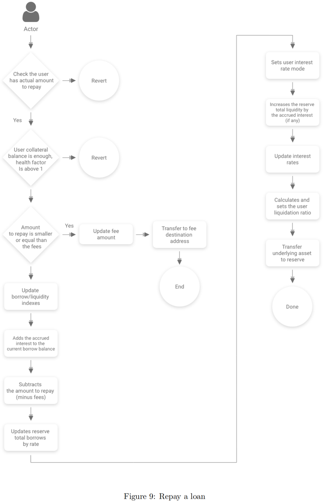

# repay=偿还

* repay = 偿还 = 偿还贷款 = 偿还借款 
  * 说明 
    * 偿还操作允许用户偿还全部或部分借款金额加上发起费用和应计利息 
  * 流程
    * 
  * 逻辑 
    * 用户可以通过repay函数来偿还贷款，不过没有金额的限制，还款金额为-1时代表全部还款。 
    * 首先计算用户当前欠款额、利息、办理手续费等信息，而后计算出用户的所需还款具体数目（本金+利息+手续费）。如果用户的还款额度小于手续费数目，那么协议优先考虑将用户的还款转入手续费收集地址；如果用户还款的额度大于没有还清的手续费，那么一样的优先偿还手续费。剩下的金额才会转入用户借款储备地址 
  * 代码
    ```js
    /** 
    * @notice repays a borrow on the specific reserve, for the specified amount (or for the whole amount, if uint256(-1) is specified). 
    * @dev the target user is defined by _onBehalfOf. If there is no repayment on behalf of another account, 
    * _onBehalfOf must be equal to msg.sender. 
    * @param _reserve the address of the reserve on which the user borrowed 
    * @param _amount the amount to repay, or uint256(-1) if the user wants to repay everything 
    * @param _onBehalfOf the address for which msg.sender is repaying. 
    **/ 
    struct RepayLocalVars { 
        uint256 principalBorrowBalance; 
        uint256 compoundedBorrowBalance; 
        uint256 borrowBalanceIncrease; 
        bool isETH; 
        uint256 paybackAmount; 
        uint256 paybackAmountMinusFees; 
        uint256 currentStableRate; 
        uint256 originationFee; 
    } 

    function repay(address _reserve, uint256 _amount, address payable _onBehalfOf) 
        external 
        payable 
        nonReentrant 
        onlyActiveReserve(_reserve) 
        onlyAmountGreaterThanZero(_amount) 
    { 
        // Usage of a memory struct of vars to avoid "Stack too deep" errors due to local variables 
        RepayLocalVars memory vars; 

        ( 
            vars.principalBorrowBalance, 
            vars.compoundedBorrowBalance, 
            vars.borrowBalanceIncrease 
        ) = core.getUserBorrowBalances(_reserve, _onBehalfOf); 

        vars.originationFee = core.getUserOriginationFee(_reserve, _onBehalfOf); 
        vars.isETH = EthAddressLib.ethAddress() == _reserve; 

        require(vars.compoundedBorrowBalance > 0, "The user does not have any borrow pending"); 

        require( 
            _amount != UINT_MAX_VALUE || msg.sender == _onBehalfOf, 
            "To repay on behalf of an user an explicit amount to repay is needed." 
        ); 

        //default to max amount 
        vars.paybackAmount = vars.compoundedBorrowBalance.add(vars.originationFee); 

        if (_amount != UINT_MAX_VALUE && _amount < vars.paybackAmount) { 
            vars.paybackAmount = _amount; 
        } 

        require( 
            !vars.isETH || msg.value >= vars.paybackAmount, 
            "Invalid msg.value sent for the repayment" 
        ); 

        //if the amount is smaller than the origination fee, just transfer the amount to the fee destination address 
        if (vars.paybackAmount <= vars.originationFee) { 
            core.updateStateOnRepay( 
                _reserve, 
                _onBehalfOf, 
                0, 
                vars.paybackAmount, 
                vars.borrowBalanceIncrease, 
                false 
            ); 

            core.transferToFeeCollectionAddress.value(vars.isETH ? vars.paybackAmount : 0)( 
                _reserve, 
                _onBehalfOf, 
                vars.paybackAmount, 
                addressesProvider.getTokenDistributor() 
            ); 

            emit Repay( 
                _reserve, 
                _onBehalfOf, 
                msg.sender, 
                0, 
                vars.paybackAmount, 
                vars.borrowBalanceIncrease, 
                //solium-disable-next-line 
                block.timestamp 
            ); 
            return; 
        } 

        vars.paybackAmountMinusFees = vars.paybackAmount.sub(vars.originationFee); 

        core.updateStateOnRepay( 
            _reserve, 
            _onBehalfOf, 
            vars.paybackAmountMinusFees, 
            vars.originationFee, 
            vars.borrowBalanceIncrease, 
            vars.compoundedBorrowBalance == vars.paybackAmountMinusFees 
        ); 

        //if the user didn't repay the origination fee, transfer the fee to the fee collection address 
        if(vars.originationFee > 0) { 
            core.transferToFeeCollectionAddress.value(vars.isETH ? vars.originationFee : 0)( 
                _reserve, 
                msg.sender, 
                vars.originationFee, 
                addressesProvider.getTokenDistributor() 
            ); 
        } 

        //sending the total msg.value if the transfer is ETH. 
        //the transferToReserve() function will take care of sending the 
        //excess ETH back to the caller 
        core.transferToReserve.value(vars.isETH ? msg.value.sub(vars.originationFee) : 0)( 
            _reserve, 
            msg.sender, 
            vars.paybackAmountMinusFees 
        ); 

        emit Repay( 
            _reserve, 
            _onBehalfOf, 
            msg.sender, 
            vars.paybackAmountMinusFees, 
            vars.originationFee, 
            vars.borrowBalanceIncrease, 
            //solium-disable-next-line 
            block.timestamp 
        ); 
    } 
    ```
