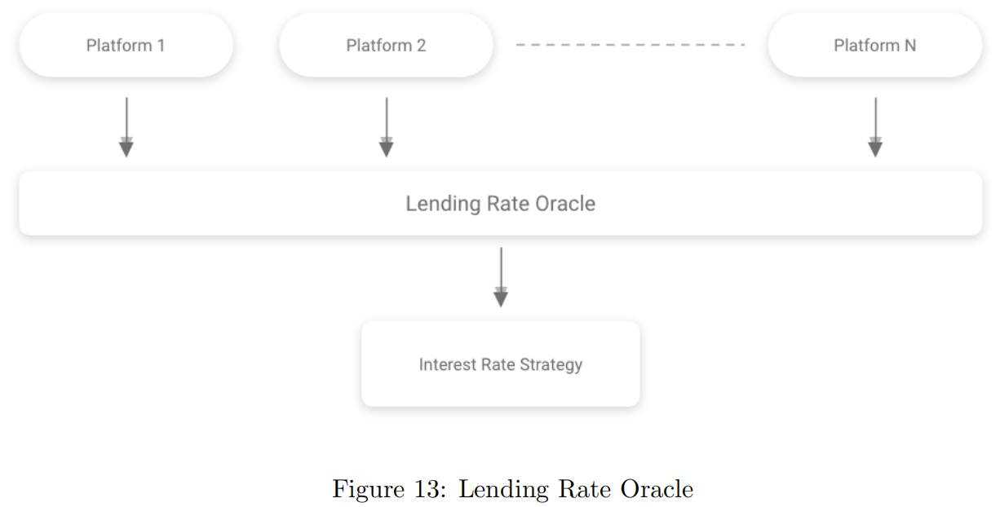
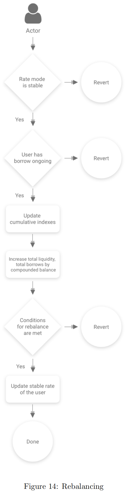

# 稳定利率

* AAVE的：稳定利率=Stable Rate ~= Stable Rate Model = Stable Rate Theory = 稳定利率模型 = 稳定利率理论 
  * 背景 
    * 接下来解释了如何将稳定率应用于系统以及其局限性。 
    * 在池上实现固定费率模型是复杂的。事实上，固定利率很难用算法来处理，因为借款成本会随着市场状况和可用流动性的变化而变化。因此，可能会出现这样的情况(突然的市场变化，银行挤兑……)，在这种情况下，处理稳定利率的借款头寸需要使用基于时间或经济约束的特定启发式方法。 
  * 处理固定利率的两种可能方法 
    * 施加时间限制 
      * 在时间有限的情况下，固定利率可能会非常有效。如果贷款有一个稳定的期限，它应该在极端的市场条件下生存，因为借款人必须在贷款期限结束时偿还。不幸的是，有时间限制的固定利率贷款不适合我们的开放式贷款的特定用例。这需要一定程度的用户体验摩擦，用户需要创建和处理具有不同时间限制的多个贷款。 
    * 施加利率限制 
      * 贷款开始时计算的利率可能会受到市场情况的影响，使其无法保持固定。如果汇率偏离市场太大，可以重新调整。这将不是一个纯粹的固定利率，开放定期贷款-因为利率可能在贷款期间变化-但用户将在特定时间段内体验实际的固定利率，或者当有足够的流动性可用时。这个特定的实现被选择以稳定速率的名称集成到Aave的协议中 
  * 相关 
    * Lending Rate Oracle=借贷利率预言机 
      * 架构图 
        * 
      * 解释 
        * 集成到协议协议中的第一个组件是贷款利率预言机Oracle，它将为合同提供其他集中式和分散式贷款平台提供的实际市场利率信息 
  * 稳定利率头寸的限制 
    * 为了避免对稳定利率贷款的滥用，对稳定利率借款模型施加了以下限制 
      * 1：用户不能存入比他们想借的流动性更多的抵押品。如。一个用户存了1000万DAI做抵押，想借100万DAI。 
        * 这是为了防止以下攻击向量: 
          * Given: B(s) = 18% APR, M(r) = 9% APR, R(l) = 12% APR 
        * 用户可能会试图通过存入大量流动性来人为地降低Bs对Mr的价值，从而导致Bs下降，然后以较低的利率从相同的流动性中借款，提取先前存入的流动性，从而导致Bs和流动性利率Rl再次上升;最后将借入的金额存入银行，以赚取先前借入资金的利息。尽管这种攻击仍然可以使用多个账户进行，但这种特殊的限制使攻击变得更加复杂，因为它需要更多的钱(和不同的抵押品货币)。这与下一阶段的利率再平衡结合起来效果很好。 
      * 2：借款人在当前的借款利率下，最多只能借到可用流动性的1%。因此，对于每一个特定的B(s)值，单个借款人只能获得高达Tr的流动性。这是为了避免某一特定借款人以过于竞争性的利率借入过多的可用流动性 
  * Rebalancing再平衡 = 稳定利率再平衡 
    * 稳定利率模型的最后一个、或许也是最重要的约束是利率再平衡。这是为了应对市场条件的变化或池内资金成本的增加。 
    * 稳定的利率再平衡将在两种具体情况下发生 
      * Rebalancing up 
        * 当用户可以通过借贷赚取利息时，用户x的稳定利率被重新平衡为最近的Bs值 
          * B(x)(s)  < Rl with B(x)(s) the stable borrow rate of user x 
      * Rebalancing down 
        * 用户x的稳定比率被重新平衡为最近的Bs值，如果: 
          * B(x)(s) > Bs(1 + ∆B(s)) 
        * ∆Bs是由治理建立的利率增量，它定义了Bs以上重新平衡利率的窗口。如果用户支付的利息超出了这个范围，利率就会被平衡下来 
    * 再平衡过程 
      * 说明 
        * LendingPool合约公开了一个函数 
          * rebalanceStableBorrowRate(address reserve, address user) 
        * 它允许重新平衡特定用户的稳定利率。任何人都可以调用这个函数:但是，调用者没有任何直接的动机来重新平衡特定用户的比率。出于这个原因，Aave将提供一个代理，定期监控所有稳定的利率头寸，并重新平衡那些被认为是必要的。再平衡策略将由代理在链下决定，这意味着满足再平衡条件的用户可能不会立即被重新平衡。由于这些条件取决于可用的流动性和市场状态，因此可能存在一些不需要立即重新平衡的临时情况。 
        * 这不会给协议增加任何中心化的元素。即使代理停止工作，任何人都可以调用LendingPool合约的rebalance函数。尽管这样做没有任何直接的动机(“我为什么要这么做?”)，但对生态系统来说有一个间接的动机。事实上，即使中介机构停止存在，存款人可能仍希望触发最低借款利率头寸的再平衡，以提高流动性率和/或迫使借款人平仓，从而增加可用的流动性。相反，在规模缩减的情况下，借款人有一个直接的动机来重新平衡他们的头寸，以降低利率。 
        * 下面的流程图解释了函数rebalanceStableBorrowRate()的操作顺序。在再平衡发生之前累积的复合余额不受再平衡的影响 
      * 流程图
        * 
