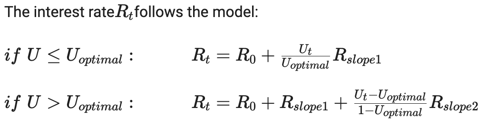
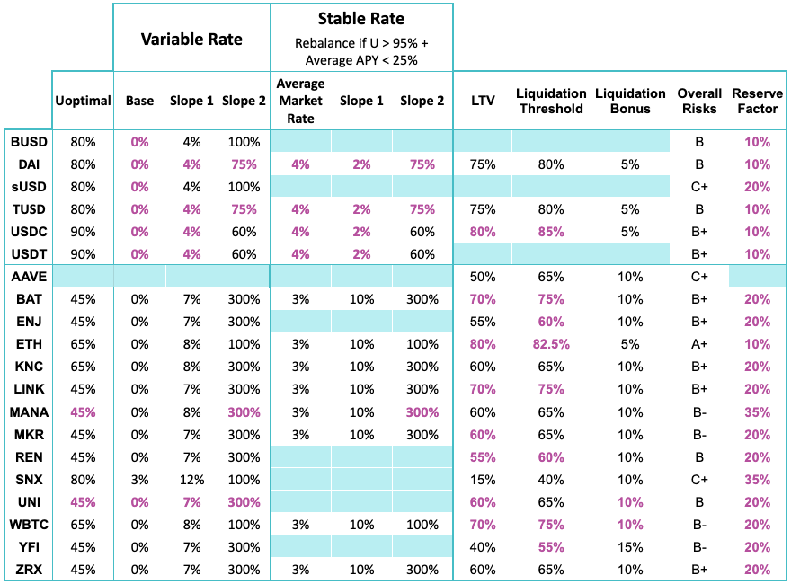
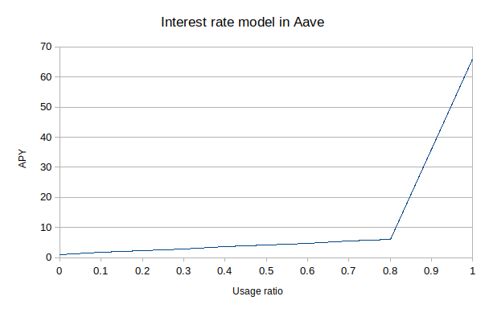
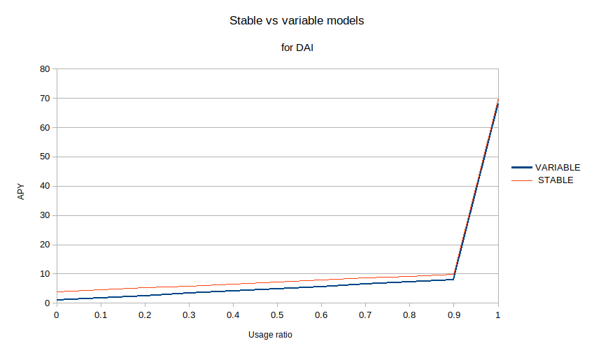
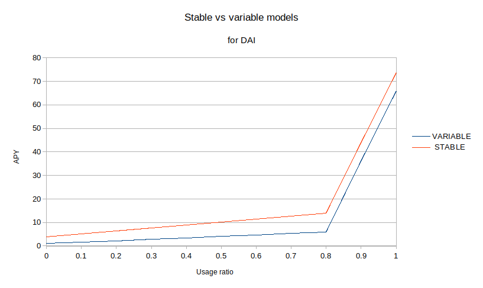

# 可变利率vs稳定利率

* AAVE借贷协议中的借贷利率 
  * 用户借贷时可选择的利率模式：可变利率 vs 稳定利率 
    * 公式
      * 
    * 利率对比图
      * 
    * 评价 
      * 可变利率：适合短期借贷 
      * 固定利率：适合长期借贷以及喜欢预测的用户 
    * 可变利率 
      * 可变借贷利率模型
        * 
  * 稳定利率 vs 可变利率 模型 
    * 新模型 
      * 模型图
        * 
      * 解释1 
        * 三个显着差异： 
          * 现在的最佳点是高达 90% 的使用率：虽然这减少了系统中的可用流动性，但它将资本配置提高了 10%，这进一步增加了存款人的 APY，同时提供更具竞争力的借款利率。鉴于目前流动性最强的稳定币储备（USDT、USDC、DAI）的规模，它仍将保证 300-400K 美元的稳定币可供提款。 
          * 最佳点的可变借款年利率现在为 8%，而不是我们之前的 6%。这使我们能够将相同的年利率保持在 80%，同时更平滑地过渡到 90%。 
          * 稳定的借贷利率曲线大幅收紧，90%使用率的稳定利率仅为9.9%（而8%的浮动利率），而在80%使用率之前为13.9%。 
      * 解释2 
        * 当资金利用率U小于最佳资金利用率Uoptimal的时候，利率的变化使用的是Rslope1斜率，但当资金利用率U大于最佳资金利用率Uoptimal时，就会额外引入Rslope2斜率，这个Rslope2斜率通常会十分高使得利率会指数性增长 
        * 但固定利率并不是一直保持固定的，在官方最新更新的利率模型中，DAI采用的利率策略是达到90%资金利用率时利率会指数型增长，在DAI的资金使用率达到95%之前，固定利率不会被重置，但如果资金使用率超过了95%固定利率就会被重置来解决流动性短缺问题 
    * 旧模型 
      * 模型图
        * 
      * 解释1 
        * 稳定利率模型与浮动利率模型相比如何？ 
        * 如您所见，当前配置对于稳定速率非常保守。它始终高于可变利率，以至于在资本使用率的 80% 下，稳定利率高出 2 倍以上（6% 可变利率对 13.9% 稳定利率）。为什么？原因是稳定利率可以被认为是一种新的金融工具，因此我们非常保守地开始使用它，有两个非常重要的原因： 
        * 我们需要收集数据并评估用户如何使用该协议以及他们的需求是什么 
        * 我们希望协议中的流动性增长到稳定利率在财务上更方便的程度：可用的流动性越多，稳定利率就越有效 
        * 这种保守的做法反映在稳定利率与浮动利率的未偿贷款之间的比率上，其中浮动利率贷款占总额的98%。有趣的是，2%的用户选择了稳定的费率，即使一开始的费率非常高，这意味着他们仍然更喜欢可预测性，即使付出了更多的代价。 
