# 各种参数

此处整理，借贷协议AAVE的借贷利率相关参数：

## AAVE中的LTV

* AAVE中的LTV=Loan-To-Value=贷款价值 
  * ~= Collateral Factor=抵押率 
    * 详见： 
      * [抵押率 · DeFi借贷协议 (crifan.org)](https://book.crifan.org/books/defi_lending_protocol/website/defi_lend_proto/terminology/stake/concepts/collateral_ratio.html)
  * 举例 
    * 存入100块，能贷出多少钱 
      * 举例：存入100，能贷出75，就是：LTV=75% 
  * 借贷池参数 
    * 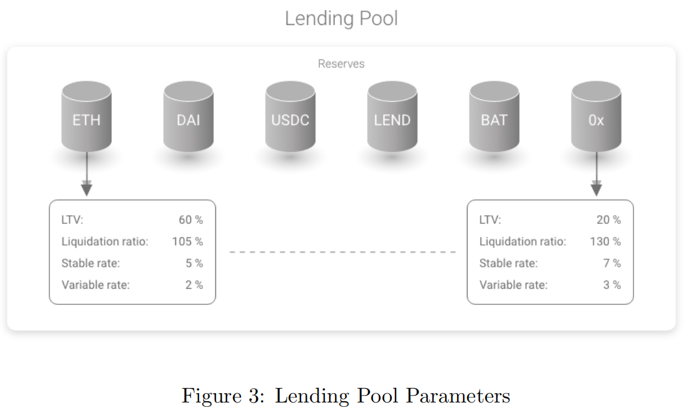
  * 举例 
    * 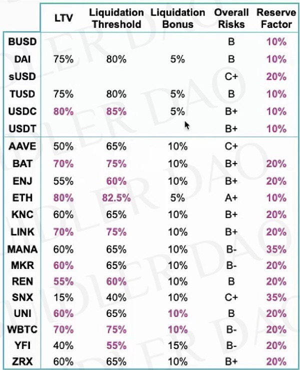

## Rv0=基础可变借贷利率

* R(v0) = Base Variable Borrow Rate = 基础可变借贷利率 
  * 常数为Bt = 0。以射线表示 
    * Constant for B(t)=0. Expressed in ray 
  * 相关代码 
    * baseVariableBorrowRate 

## Rv=可变借贷利率

* R(v) = Variable Borrow Rate =可变借贷利率 
  * 公式 
    * 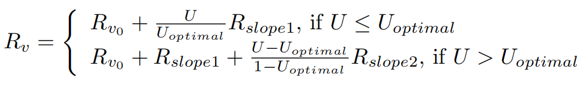
  * 此利率模型可校正主要利率: 
    * 当 U = 0： R(v) = R(v0)
    * 当U = Uoptimal：R(v) = R(v0) + Rslope1 
    * 高于 Uoptimal：考虑到资金成本，利率急剧上升 

## Rs=稳定借贷利率

* R(s =) Stable Borrow Rate = Current Stable Borrow Rate = 稳定借贷利率 
  * 计算公式  
    * 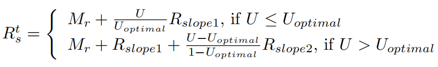
  * 说明 
    * M(r)：平均市场贷款利率 
      * the average market lending rate 
    * R(slope1)：在非最优条件下的利率，斜率随着U的增加而增加 
      * the interest rate slope below Uoptimal, increases the rate as U increases. 
    * R(slope2) ：超出非最优的利率，斜率随着U与非最优之差的增大而增大 
      * the interest rate slope beyond Uoptimal, increases as the difference between U and Uoptimal increases. 
    * U：是利用率 
      * is the utilization rate. 
  * 注意 
    * Rs不会影响现有的稳定利率头寸-这只适用于新开的头寸 
      * R(s) does NOT impact existing stable rates positions – this is applied only to new opened positions. 
  * 以射线表示 
    * Expressed in ray 

## Rslope1=斜率1

* R(slope1) = Interest Rate slope below U(optimal)
  * 常数，当U <Uoptimal 时，表示利率与利用率的比例。以射线表示 
    * Constant representing the scaling of the interest rate versus the utilization, when U < U(optimal). Expressed in ray 

## Rslope2=斜率2

* R(slope2) = Interest Rate slope above U(optimal)
  * 常数表示利率与利用率的比例，当U≥ U(optimal)。以射线表示 
    * Constant representing the scaling of the interest rate versus the utilization, when U ≥ U(optimal). Expressed in ray 

## Ro=总体借贷利率

* R(o) = Overall borrow rate=总体借贷利率 
  * 公式
    * 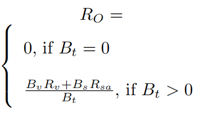
  * 说明 
    * 准备金的总借款率，以总可变借款Bv与总稳定借款b的加权平均值计算 
      * Overall borrow rate of the reserve, calculated as  the weighted average between the total variable borrows Bv and the total stable borrows Bs 

## Mr=平均市场借贷利率

* Mr=平均市场借贷利率=average Market lending rate 
  * 公式
    * 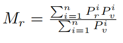
    * 参数说明 
      * i：平台个数 
      * M(r：)平均市场借贷利率 
      * P(r)(i)：借贷利率=贷款利率 
      * P(i)(v)：借贷量 
  * 含义解释 
    * 基本稳定借款利率，以射线表示 
    * 市场价格将每日更新，最初由Aave 

## Rsa=平均稳定借贷利率

* Rsa = Average Stable rate borrow rate=平均稳定借贷利率 
  * 公式
    * 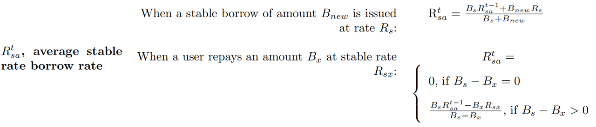
  * 说明 
    * 详见函数 
      * decreaseTotalBorrowsStableAndUpdateAverageRate() 
      * increaseTotalBorrowsStableAndUpdateAverageRate() 
    * 以射线表示 
      * Expressed in ray 

## Rl=当前流动性比例

* R(l)=current Liquidity rate=当前流动性比例 
  * 公式
    * 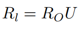
  * 说明 
    * 总借款利率R(O)与利用率U的函数 
      * Function of the overall borrow rate RO and the utilization rate U 

## Bx=PB=用户本金借款余额

* User Principal borrow Balance=用户本金借款余额 
  * 旧=AAVE V1 
    * 变量：B(x)
    * 说明 
      * 当用户打开借贷头寸时存储的余额。在多次借款的情况下，复利每次累积，它成为新的本金借款余额 
        * Balance stored when a user opens a borrow position. In case of multiple borrows, the compounded interest is cumulated each time and it becomes the new principal borrow balance 
  * 新=AAVE V2 
    * 变量：PB(x) 
    * 说明 
      * 当用户打开借贷头寸时存储的余额。在多次借款的情况下，复利每次累积，它成为新的本金借款余额。 

## Bvcx=VI=用户累计浮动借款指数

* B(t)(vcx)=user Cumulated Variable borrow indeX=用户累计可变利率借款指数 = 用户借款累积指数=用户累计浮动借款指数 
  * 旧=AAVE V1 
    * 公式
      * 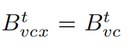
    * 说明 
      * 特定用户的变量借款指数，在用户打开（新增？）变量借款头寸时存储 
        * Variable borrow index of the specific user, stored when a user opens a variable borrow position 
  * 新=AAVE V2 
    * 公式 
      * 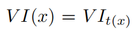
    * 说明 
      * 特定用户的可变借款指数，在用户新开可变借款头寸时存储 

## Bvc=VIt=累计可变利率借款指数

* B(t)(vc)=Cumulated Variable Borrow index=累计可变利率借款指数 = 借款累积指数=累计浮动借款指数 
  * 旧=AAVE V1 
    * 公式
      * 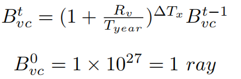
    * 说明 
      * 由变量借款Bv按利率Rv累积的利息，在借款、存款、偿还、赎回、切换利率、清算事件发生时更新 
  * 新=AAVE V2 
    * 含义 
      * 从池子首次发生用户操作时，累计到现在，每单位借款债务，共变成多少债务 
      * 变量借款VB在一段时间∆T内以可变利率V R累计的利息 
    * 公式
      * 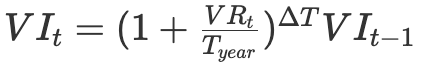
    * 说明 
      * 在发生借款、存款、偿还、赎回、掉期、清算事件时更新 
      * 这里使用复利公式计算利息，每次存钱、取钱、借钱、赎回、清算操作等动作 
      * 因为在链上计算成本高，AAVE使用了泰勒展开式模拟这个公式，为了避免昂贵的求幂，使用二项式近似进行计算。 
        * 参考链接 
          * https://github.com/aave/protocol-v2/blob/ce53c4a8c8620125063168620eba0a8a92854eb8/contracts/protocol/libraries/math/MathUtils.sol#L45
      * 不举例子了 
      * 任务每次计算复利的时候，VIt都会大一点点，跟流动性累计指数相似。 
      * 注意这里的复利周期是每秒计算的 
    * 代码 
      * CoreLibrary 
        * 储备和用户数据的数据结构

```js
struct UserReserveData { 
    //principal amount borrowed by the user. 
    uint256 principalBorrowBalance; 
    //cumulated variable borrow index for the user. Expressed in ray 
    uint256 lastVariableBorrowCumulativeIndex; 
    //origination fee cumulated by the user 
    uint256 originationFee; 
    // stable borrow rate at which the user has borrowed. Expressed in ray 
    uint256 stableBorrowRate; 
    uint40 lastUpdateTimestamp; 
    //defines if a specific deposit should or not be used as a collateral in borrows 
    bool useAsCollateral; 
} 

struct ReserveData { 
    /** 
    * @dev refer to the whitepaper, section 1.1 basic concepts for a formal description of these properties. 
    **/ 
    //the liquidity index. Expressed in ray 
    uint256 lastLiquidityCumulativeIndex; 
    //the current supply rate. Expressed in ray 
    uint256 currentLiquidityRate; 
    //the total borrows of the reserve at a stable rate. Expressed in the currency decimals 
    uint256 totalBorrowsStable; 
    //the total borrows of the reserve at a variable rate. Expressed in the currency decimals 
    uint256 totalBorrowsVariable; 
    //the current variable borrow rate. Expressed in ray 
    uint256 currentVariableBorrowRate; 
    //the current stable borrow rate. Expressed in ray 
    uint256 currentStableBorrowRate; 
    //the current average stable borrow rate (weighted average of all the different stable rate loans). Expressed in ray 
    uint256 currentAverageStableBorrowRate; 
    //variable borrow index. Expressed in ray 
    uint256 lastVariableBorrowCumulativeIndex; 
    //the ltv of the reserve. Expressed in percentage (0-100) 
    uint256 baseLTVasCollateral; 
    //the liquidation threshold of the reserve. Expressed in percentage (0-100) 
    uint256 liquidationThreshold; 
    //the liquidation bonus of the reserve. Expressed in percentage 
    uint256 liquidationBonus; 
    //the decimals of the reserve asset 
    uint256 decimals; 
    /** 
    * @dev address of the aToken representing the asset 
    **/ 
    address aTokenAddress; 
    /** 
    * @dev address of the interest rate strategy contract 
    **/ 
    address interestRateStrategyAddress; 
    uint40 lastUpdateTimestamp; 
    // borrowingEnabled = true means users can borrow from this reserve 
    bool borrowingEnabled; 
    // usageAsCollateralEnabled = true means users can use this reserve as collateral 
    bool usageAsCollateralEnabled; 
    // isStableBorrowRateEnabled = true means users can borrow at a stable rate 
    bool isStableBorrowRateEnabled; 
    // isActive = true means the reserve has been activated and properly configured 
    bool isActive; 
    // isFreezed = true means the reserve only allows repays and redeems, but not deposits, new borrowings or rate swap 
    bool isFreezed; 
}
```

  * 更新 
    * 与v1版本不同的是，在更新储备状态时会将一部分产生的利息收入存入金库（treasury）中，具体的比例由储备的reserveFactor（configuration字段的一个值）来确定

```js
/** 
 * @dev Updates the liquidity cumulative index and the variable borrow index. 
* @param reserve the reserve object 
**/ 
function updateState(DataTypes.ReserveData storage reserve) internal { 
  uint256 scaledVariableDebt = 
    IVariableDebtToken(reserve.variableDebtTokenAddress).scaledTotalSupply(); 
  uint256 previousVariableBorrowIndex = reserve.variableBorrowIndex; 
  uint256 previousLiquidityIndex = reserve.liquidityIndex; 
  uint40 lastUpdatedTimestamp = reserve.lastUpdateTimestamp; 


  (uint256 newLiquidityIndex, uint256 newVariableBorrowIndex) = 
    _updateIndexes( 
      reserve, 
      scaledVariableDebt, 
      previousLiquidityIndex, 
      previousVariableBorrowIndex, 
      lastUpdatedTimestamp 
    ); 


  _mintToTreasury( 
    reserve, 
    scaledVariableDebt, 
    previousVariableBorrowIndex, 
    newLiquidityIndex, 
    newVariableBorrowIndex, 
    lastUpdatedTimestamp 
  ); 
}
```

## Bxc=用户复利借款余额

* B(x)(c)=user Compounded borrow Balance=用户复利借款余额 
  * 旧=AAVE V1 
    * 公式
      * 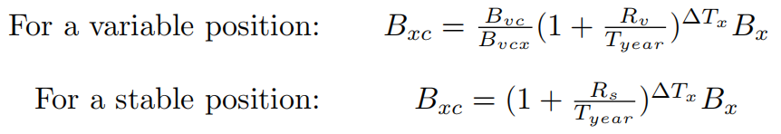
    * 说明 
      * 本金Bx加上累计利息 
        * Principal Bx plus the cumulated interests 
  * 新=AAVE V2 
    * 代码

```js
struct RepayLocalVars { 
    uint256 principalBorrowBalance; 
    uint256 compoundedBorrowBalance; 
    uint256 borrowBalanceIncrease; 
    bool isETH; 
    uint256 paybackAmount; 
    uint256 paybackAmountMinusFees; 
    uint256 currentStableRate; 
    uint256 originationFee; 
} 

function repay(address _reserve, uint256 _amount, address payable _onBehalfOf) 
    external 
    payable 
    nonReentrant 
    onlyActiveReserve(_reserve) 
    onlyAmountGreaterThanZero(_amount) 
{ 
    // Usage of a memory struct of vars to avoid "Stack too deep" errors due to local variables 
    RepayLocalVars memory vars; 


    ( 
        vars.principalBorrowBalance, 
        vars.compoundedBorrowBalance, 
        vars.borrowBalanceIncrease 
    ) = core.getUserBorrowBalances(_reserve, _onBehalfOf); 
... 
```

## Dassett=债务总额

* D(asset)(t = )Total Debt=债务总额 
  * 公式
    * 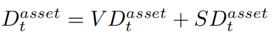
  * 说明 
    * 借入的流动资金总额 
      * Total amount of liquidity borrowed 

## VDassett=可变债务代币总额

* VD(asset)(t = )Total Variable Debt Tokens=可变债务代币总额 
  * 说明 
    * 以债务代币表示的可变利率借入的流动性总额 
      * Total amount of liquidity borrowed at a variable rate represented in debt tokens 

## SDassett=稳定债务代币总额

* SD(asset)(t = )Total Stable Debt Token=稳定债务代币总额 
  * 说明 
    * 以债务代币表示的稳定利率借入的流动性总额 
      * Total amount of liquidity borrowed at a stable rate represented in debt tokens 

## Lassett=资产的总流动性

* L(asset)(t = )Total Liquidity of an asset=资产的总流动性 
  * 说明 
    * 资产准备金中可用的流动资金总额。该值的小数取决于货币的小数 
      * Total amount of liquidity available in the assets reserve. The decimals of this value depend on the decimals of the currency 

## Ci=LIt=流动性累计指数

* C(t)(i)=Cumulated liquidity Index=流动性累计指数 
  * 旧=AAVE v1 
    * 公式
      * 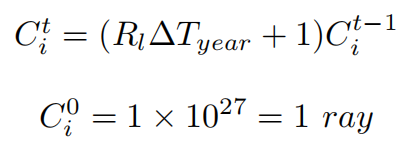
    * 说明 
      * 准备金在时间间隔∆T期间累积的利息，在发生借款、存款、偿还、赎回、掉期、清算事件时更新。 
        * Interest cumulated by the reserve during the time interval ∆T , updated whenever a borrow, deposit, repay, redeem, swap, liquidation event occurs 
  * 新=AAVE v2 
    * 公式
      * 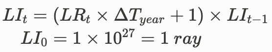
    * 说明 
      * 从池子首次发生用户操作时，累计到现在，每单位存款本金，变成多少本金（含利息收入） 
    * 存储
      ```js
      struct ReserveData { 
          //the liquidity index. Expressed in ray 
          uint128 liquidityIndex; 
        }
      ```
    * 更新
      ```js
      function _updateIndexes( 
          DataTypes.ReserveData storage reserve, 
          uint256 scaledVariableDebt, 
          uint256 liquidityIndex, 
          uint256 variableBorrowIndex, 
          uint40 timestamp 
        ) internal returns (uint256, uint256) { 
          uint256 currentLiquidityRate = reserve.currentLiquidityRate; 
          uint256 newLiquidityIndex = liquidityIndex; 

          //only cumulating if there is any income being produced 
          if (currentLiquidityRate > 0) { 
            uint256 cumulatedLiquidityInterest = 
              MathUtils.calculateLinearInterest(currentLiquidityRate, timestamp); 

            newLiquidityIndex = cumulatedLiquidityInterest.rayMul(liquidityIndex); 
            require(newLiquidityIndex <= type(uint128).max, Errors.RL_LIQUIDITY_INDEX_OVERFLOW); 

            reserve.liquidityIndex = uint128(newLiquidityIndex); 
          } 

          reserve.lastUpdateTimestamp = uint40(block.timestamp); 
        } 
      }
      ```

## Itn=NIt=归一化收入

* I(t)(n)=reserve Normalized Income=归一化收入 
  * 含义：每单位存款本金，未来将变成多少本金（含利息收入） 
  * 旧=AAVE V1 
    * 公式
      * 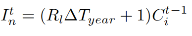
    * 说明 
      * 准备金累积的持续利息 
        * Ongoing interest cumulated by the reserve 
  * 新=AAVE V2 
    * 公式
      * 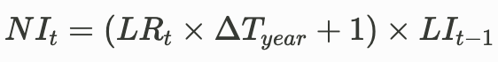
  * 代码 
    * getNormalizedIncome

```js
  /** 
   * @dev Returns the ongoing normalized income for the reserve 
  * A value of 1e27 means there is no income. As time passes, the income is accrued 
  * A value of 2*1e27 means for each unit of asset one unit of income has been accrued 
  * @param reserve The reserve object 
  * @return the normalized income. expressed in ray 
  **/ 
  function getNormalizedIncome(DataTypes.ReserveData storage reserve) 
    internal 
    view 
    returns (uint256) 
  { 
    uint40 timestamp = reserve.lastUpdateTimestamp; 

    //solium-disable-next-line 
    if (timestamp == uint40(block.timestamp)) { 
      //if the index was updated in the same block, no need to perform any calculation 
      return reserve.liquidityIndex; 
    } 

    uint256 cumulated = 
      MathUtils.calculateLinearInterest(reserve.currentLiquidityRate, timestamp).rayMul( 
        reserve.liquidityIndex 
      ); 

    return cumulated; 
  }
```
