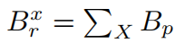
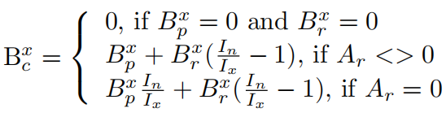
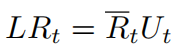
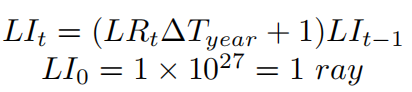
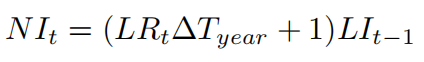
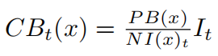
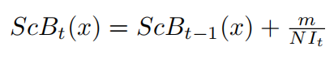
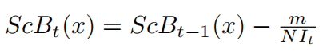
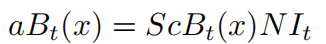

# aToken

* aToken = Aave Token = Aave代币 
  * 复数：aTokens 
  * 是什么：AAVE计息代币 
    * AAVE借贷协议的协议代币，带利息的衍生代币 
  * 逻辑 
    * 概述 
      * 在存入时铸造，在提取时烧毁 
      * 代币的价值以1:1的比率与相应的存款资产挂钩 
    * 详解 
      * 当您在 Aave 协议中存款时，您会收到相应数量的 aToken，它们与基础资产 1:1 挂钩 
      * 当用户将资金存入协议时，他们会收到ERC -20标准协议代币（aTokens）作为交换 
        * 这些代币可以在任何时候交换回原始资产 
  * 作用 
    * 计息 
      * 此时可以加：Aave计息代币 
      * aTokens 直接在您的钱包中产生利息，因此您可以看到每秒余额的增长 
      * 您可以选择在任何以太坊地址接收此利息 
    * 借款时的利率转换 
      * 使您可以随时在稳定利率和浮动利率之间进行选择，从而始终获得最佳利率 
        * 例如 
          * 如果您最初选择的是浮动利率，但随后该利率急剧上升，则可以切换到稳定利率 
          * 我们还调整了利率模型，以填补浮动利率模型和稳定利率模型之间的空白，从而使新的稳定利率更具竞争力 
  * 更多细节 
    * Aave协议为流动性提供商实现了代币化策略。存款后，存款人会收到相应数量的衍生代币，称为Aave代币(简称aTokens)，它们以1:1的比例映射基础资产。每个存款人的代币余额随着时间的推移而增长，这是由于存款利息的不断增加。代币完全符合ERC20标准 
    * 代币本身也实现了利率重定向的概念。事实上，随着时间的推移，借款人的利率支付所累积的价值与本金价值是不同的。一旦有了atoken的余额，累积值可以重定向到任何地址，有效地分割余额和生成的利息。我们把随着时间的推移不断积累的利息流称为利息流
    * 为了实现这一令牌化策略，我在aToken合约中引入了以下概念: 
      * User x balance index I(t)(x):是用户执行最后一个操作时的储备归一化收益I(t)(x)的值 
      * Principal balance B(p)：是存储在ERC20 token合约的余额映射中的余额。用户在aToken合约上执行的每个操作(存款、赎回、转移、清算、利率重定向)都会更新本金余额 
      * Redirection address A(r)：当用户决定将他的利息流重定向到另一个地址时，将提供一个新的重定向地址A(r)。如果不进行兴趣流重定向，则A(r) = 0 
      * Redirected Balance B(x)(r) ：每当用户重定向自己的利息流时，用户重定向的余额将被添加到B(r)指定地址的重定向余额B(r)中 
        * 定义如下
          * 
            * 其中x是将利息流重定向到用户(X)的用户集合 
        * 每当用户x0∈X将其aToken兑换或转移给另一个没有重定向到X的用户时，重定向余额就会减少 
      * Current balance B(c)：是attoken合约的balanceOf()函数返回的余额 
        * 定义如下 
          * 
  * 代币化模型的局限性 
    * 与广泛使用的基于汇率的方法相比，所描述的代币化模型具有许多优点，但也有一些缺点，具体来说: 
      * 1. 一次转移全部余额是不可能的 
        * 考虑到利率的永久累积，没有办法指定要转移的确切金额，因为即使在转账交易被确认时，利息也会继续增加。这意味着转账后的余额完全为0是不可能的，相反，执行转账的账户将留下非常小的余额(尘埃余额)。注意，本可以通过添加特定的逻辑来处理这种特殊的边缘情况来避免这种情况，但是这种情况会发生意味着在ERC20传递函数中添加非标准行为，因此我们避免了它。 
        * 尽管这不是一个相关的问题，但重要的是要注意，可以通过 
          * 1：来完全清除剩余的余额。执行另一次转移，这很可能会转移剩余的灰尘余额，因为它太小，无法在相当短的时间内产生兴趣 
          * 或者2：赎回尘埃余额并转让标的资产 
      * 2. 利息流只能在有本金余额的情况下重定向 
        * 这意味着只有本金余额为Bp的账户才能重定向其利息。如果用户兑换或转移所有内容，则会重置他们的利息重定向。这样做的一个副作用是，仅由重定向余额Br生成的利息不能重定向 

AAVE v2
* 升级aToken 
  * V2的aToken有如下更新： 
    * 支持EIP-2612 
    * 在基本的aToken实现中没有利率重定向-这可能会在将来重新引入 
  * 从v1到v2，没有变化的定义有 
    * LR(asset)(t)  = current Liquidity Rate 
      * 总体借款利率和使用率的函数 
      * 公式
        * 
    * LI(t) = cumulated Liquidity Index 
      * 准备金在时间间隔∆T期间累积的利息，在发生借款、存款、偿还、赎回、交换swap、清算事件时更新 
      * 公式 
        * 
    * NI(t) = reserve Normalised Income 
      * 准备金累积的持续利息 
      * 公式
        * 
  * 在V1中，每次操作后，NIt被存储为用户x索引NI(x)，对于用户x，累积的aToken余额的计算方法如下 
    * 
  * 在V2中，用户索引实际上作为存储变量消失，并与主体余额一起作为称为 Scaled Balance = 缩放余额 = ScB 的比率存储 
  * 计算用户的余额，导致每次操作的增加或减少，导致aToken的铸造或燃烧 
    * Deposits=存款 
      * 当用户在协议中存入金额m时，他的缩放余额更新如下 
        * 
    * Withdrawals=取款 
      * 当用户在协议中提取金额m时，他的缩放余额更新如下
        * 
  * 在任何时间点，用户的aToken余额都可以写成
    * 
  * 相关开发者文档 
    * [aTokens | v2 | Developers (aave.com)](https://docs.aave.com/developers/v/2.0/the-core-protocol/atokens)
