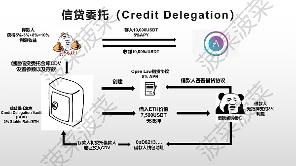

# Credit Delegation信用委托

* Credit Delegation=信用委托=信贷委托 
  * 概述 
    * 用户可以将它在AAVE中deposit得到的信用额度转移给其他账户，而其他账户可以拿着得到的信用额度来进行贷款等 
    * 信用委托是一项简单的交易，Aave协议的储户将信用额度委托给他们信任的人 
  * 流程和逻辑 
    * 
  * 详解 
    * 在债务标记化之上，V2支持信用委托:borrow()函数支持不同地址的信用额度，而不需要抵押品，只要调用者地址被授予许可。 
    * 此功能是通过每个债务令牌上的approveDelegation()函数实现的。用户将能够为特定的债务模式(稳定或可变)制定他们的津贴。borrow()函数有一个onBehalfOf参数，供调用者指定用于提取贷款的地址。 
  * 权衡trade-off 
    * 信贷授权的实施需要作出一些权衡: 
      * 一个代理人可以将信用委托给多个实体，但一个代理人一次只能从一个代理人处提取信用。一个人不能在一次借款中把代理人的债务加起来() 
      * 受托人可以同时向实体委托稳定和可变信贷，但受托人不能从单一借款中提取可变和稳定信贷() 

