# Debt Tokenization=债务代币化

* 债务代币化=Debt Tokenization 
  * 借款人的债务现在由代币表示，而不是内部审计，使得 
    * 关于协议的借用方面的代码简化 
      * 一些计算现在隐含在债务代币的铸造/燃烧逻辑中 
    * 同时借款可变和多个稳定利率 
      * 在V1中，借款人的贷款要么是可变的，要么是稳定的，之前的贷款会自动切换到最新的贷款利率。在V2中，用户可以同时持有多种贷款，包括可变利率和多个稳定利率头寸。多个稳定利率头寸是通过所持稳定利率贷款利率的加权平均来处理的。 
    * 本地信用委托 
      * 通过委托的概念，用户可以通过打开信用额度委托到其他地址。可以在上面开发一些有趣的工具 
      * 例如 
        * 从冷钱包中借款 
          * 用户可以将抵押品存放在冷钱包中，只需将其信用委托给热钱包进行借款。整个头寸可以从热钱包管理，有借款、还款和增加更多的抵押品;而资金则被放在一个安全的冷钱包里。 
        * 信委托安排 
          * 用户只要获得提供担保的其他用户的委托，就可以获得担保不足的贷款 
        * 自动挖矿收入 
          * 信贷授权使构建工具成为可能，以便在多个协议上自动打开挖矿信贷额度 
  * 细节实现 
    * 债务代币的总供应量(包括每秒累积的债务)定义如下:
      * 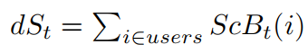
    * 某项资产在时刻t的总负债定义为
      * 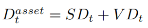
        * 该定义取代了V1白皮书第1.2节中描述的V1的稳定或可变借款总额 
  * Variable Debt=可变利率债务
    * 在V2中，债务代币遵循与V1中的代币相同的不断增长的逻辑。可变债务代币遵循缩放平衡方法。引入了归一化可变累计债务的概念 
      * 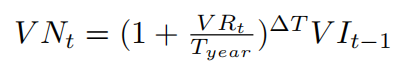
    * ScVB(t)(x)为用户x在时刻t的缩放余额，m为交易金额，VN(t)为归一化可变债务 
      * Borrows借款 
        * 当用户x从协议中借入金额m时，缩放后的余额更新 
          * 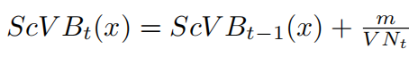
      * Repays偿还/Liquidations清算 
        * 当用户x偿还或清算金额m时，缩放余额更新 
          * 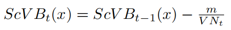
    * 在任意时间点，用户的总可变债务余额可以写成 
      * 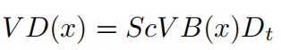
    * 这个可变债务代币余额取代了V1白皮书第1.2节中描述的V1的用户可变借款余额 
    * 相关开发者文档 
      * [Debt Tokens | v2 | Developers (aave.com)](https://docs.aave.com/developers/v/2.0/the-core-protocol/debt-tokens)
  * Stable Debt=稳定利率债务
    * 对于稳定利率债务，V1定义如下 
      * SR (asset )(t ) = 
        * 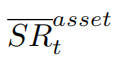
      *  = overall stable rate=总体稳定利率 
        * 当一个稳定的借款金额SBnew按利率发行SR(t)
          * 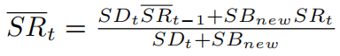
        * 当用户x，以稳定利率SRi(x)，以金额SBi(x)，偿还稳定借款i时
          * 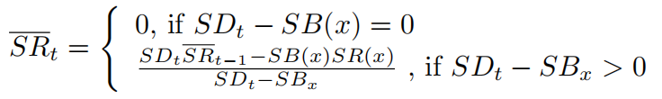
    * SRt存储在每个特定货币的稳定利率代币中。用户x的稳定债务代币SD(x)余额定义如下 
      * 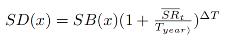
    * 在V1中，用户x的稳定利率SR(x)总是等于上次贷款的稳定利率，以前的贷款在新贷款上进行再平衡。从V2开始，每i笔稳定贷款的资产准备金计算稳定利率SR(x): 
      * 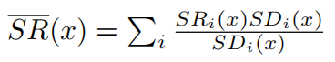
