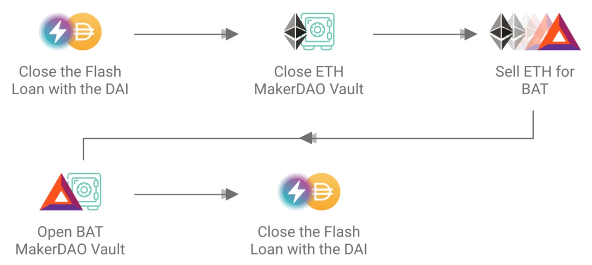
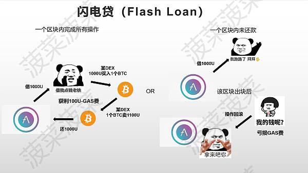
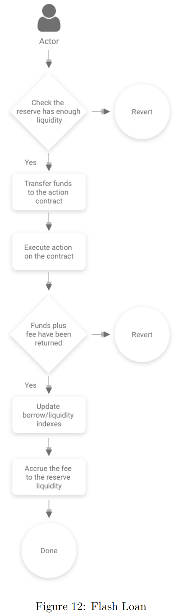
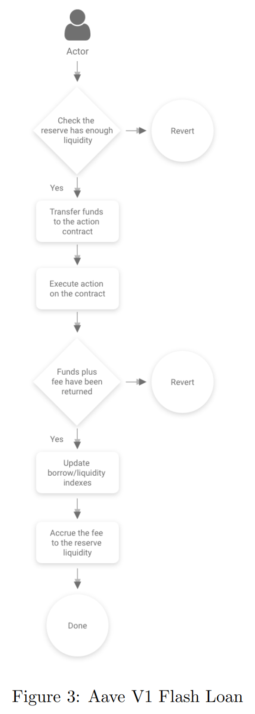

# Flash Loan闪电贷

* Flash Loan= Flash贷款=闪贷=闪电贷=闪电贷款 
  * 所属领域：AAVE借贷协议中的一种贷款方式 
  * 是什么：无需任何资金抵押就可以借款 
    * 无需任何抵押品也可以进行贷款且可以保障资金一定会返还 
    * 闪电贷款将允许用户在单笔交易中从储备中借款，只要用户返还更多的流动性。 
  * 原理 
    * 通过在一个区块内完成包含借款以及还款的操作的一个事务来实现无抵押贷款，由于区块链的特性，一个区块只有被打包出块的时候才会成为一个已经发生的“事实”，用户使用闪电贷时需要在一个区块内完成一个包含借款——交易操作——还款的操作才算一个成功的事务 
    * 任何一环如果操作失败了都无法完成 
      * 比如当用户使用闪电贷借出了一笔资金后并未作出还款的操作，那么这笔资金就会自动回滚到原来的地方，就像一切都没有发生过，因为这笔操作在一个区块中属于一个失败的事务无法变成一个“事实” 
  * 评价 
    * DeFi行业的首个无担保贷款解决方案 
    * Aave最突出的产品之一 
  * 特点 
    * 使用时间短 == 门槛高 ~= 多数是用代码实现 
      * 闪贷必须在相同的金融操作中偿还，这意味着它们只发行几分钟甚至几秒钟 
      * 但由于闪电贷需要在一个区块内完成所有操作，人工操作是无法实现闪电贷的，需要依靠代码来完成闪电贷的操作，使用门槛相对较高 
    * 只需要支付一次GAS费以及闪电贷协议费的成本 
      * 如果有好的套利机会闪电贷可以获得的利润是没有上限的 
  * 作用=用途 
    * （主要用于）套利 
    * 抵押品闪兑 
    * 偿还欠款 
      * 以避免清算罚款 
      * ~= 债务交换 
      * 举例 
        * DeFi Saver 可让您在一个地方管理所有 DeFi 活动。它还可以让您设置一个自动自我清算程序，用闪贷来偿还债务，释放抵押品并出售部分抵押品来偿还 Aave 协议，从而避免清算处罚 
  * 架构
    * 
  * 逻辑图 
    * 
  * 流程 
    * 说明 
      * 闪贷暂时将资金转移到一个遵循IFlashLoanEnabledContract.sol接口的智能合约中。合同的地址是动作的参数。资金转移之后，在外部合约上执行executeOperation()方法。合同可以用借来的资金做任何需要做的事情。方法executeOperation()完成后，将执行检查以验证资金加上费用已经返回到LendingPool合同。然后将费用累加到储备中，并存入状态储备被更新。如果归还给准备金的资金少于所借的资金，这笔交易就被取消恢复 
    * 图
      * 

## Flash Loan V2

* AAVE借贷协议：V2 
  * 闪电贷V1 = Flash Loan V1 
    * 流程图
      * 
    * 检查资金是否已转移的步骤如下 
      * 在将资金转移到执行者U之前，协议对闪贷资产的余额进行快照 
      * 在闪电贷款结束时，检查强制执行合同余额包括闪电借款金额加上闪电贷款溢价。如果金额不正确，交易将被撤销。 
    * 这限制了Flash Loans在Aave中的使用，因为允许其他操作(特别是存款、还款和清算)可能会使协议暴露于重新进入的风险中。因此，这些操作通过重入保护机制进行互斥 
    * 闪贷是Aave V1的一项颠覆性功能，它允许创建各种工具来进行再融资、抵押品互换、套利和清算。闪贷已经成为一种强大的DeFi机制。 
  * 闪电贷V2=Flash Loan V2 
    * 概述 
      * 在最初的V1闪贷中，一个重要的限制是它不能在Aave中使用。Aave V2实现了一个解决方案，使Flash贷款的使用与协议的任何其他功能相结合，提供了许多新的可能性 
        * 押品交易 
          * 将风险敞口(exposure)从一个或多个抵押品更改为另一个抵押品，而无需关闭债务头寸(debt position) 
        * 抵押品偿还贷款 
          * 在协议中使用担保存款来偿还债务 
        * 证金交易 
          * 创建保证金头寸，可用于以后的交易 
        * 债务互换 
          * 将债务敞口从一种资产转换为另一种资产 
        * 保证金存款 
    * 细节 
      * 解释1 
        * V2提供了一种新颖的防止重入的保护，允许对所有的交易使用闪贷 
        * 具体方案：最初的实现是为特定的ETH代码路径选择的;不幸的是，ETH不支持拉支付策略(pull payment strategy.)。在这个新的版本2中，所有eth相关的代码已经被删除，导致以下变化: 
          1. 闪贷启动资金转移到闪贷执行人u， 
          2. 最后，资金从执行人那里收回，金额等于借入的资金加上费用。如果抽回资金不成功，闪贷失败;例如，当资金缺乏批准或缺乏资金来支付债务时。 
        * 这在技术上消除了对前后余额快照的需要，因此消除了重入检查的需要 
        * 此外，闪贷现在支持多种模式:闪贷调用者可以决定保持贷款开放，但要有适当的流动性来满足抵押品要求 
      * 解释2 
        * 协议内部 
          * 在Aave v2中，在协议本身内可以实现闪贷。事实上，它们在协议中广泛用于头寸交换和其他“交易”功能 
        * 批量闪贷=Batch flash loans 
          * 闪贷现在可以分批执行，即在同一调用中具有不同参数的多个闪贷。这将允许强大的新用例，例如通过一次闪贷交易偿还多个资产和头寸 
        * 闪贷模式 
          * 你现在可以执行一种“传统”的闪贷组合，即立即偿还，以及发生债务的闪贷(即闪贷不会立即偿还)。 
