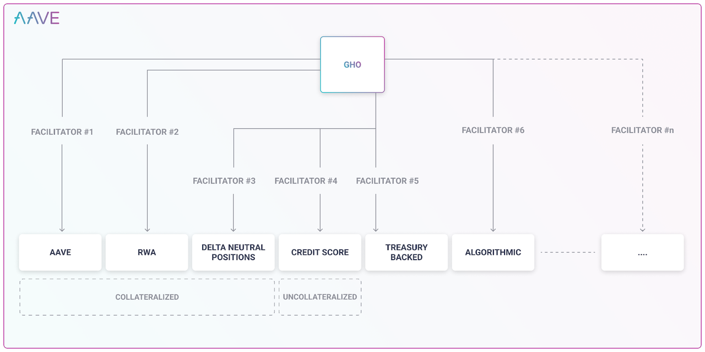
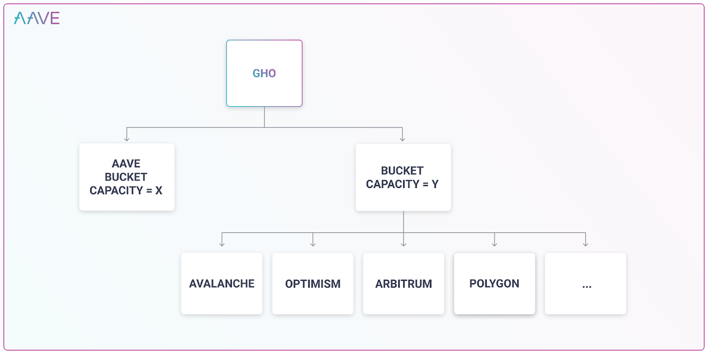

# 稳定币GHO

* GHO 
  * 是什么：稳定币的一种 
    * AAVE新推出的稳定币 
  * 名称由来 
    * （猜测）AAVE是芬兰语的幽灵，幽灵的英文是Ghost，所以取前3个字母：GHO 
  * GHO的一些机制 
    * GHO将是Decentralized 
    * GHO由持续提供收益的资产进行超额抵押生成 
    * GHO由AAVE协议多种类型的抵押品提供支持 
    * GHO由AAVE社区治理 
    * 安全模块参与者（stkAAVE持有者）可以以折扣价格铸造GHO 
    * GHO引入了“促进者”（facilitator）的概念：可以无需信任生成或销毁GHO 
    * GHO引入门户（Portal）将为在多链世界中扩展GHO提供理想的路径 
  * 架构图
    * 
    * 
