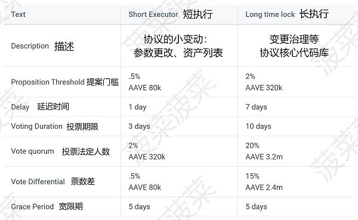
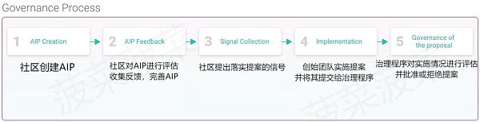
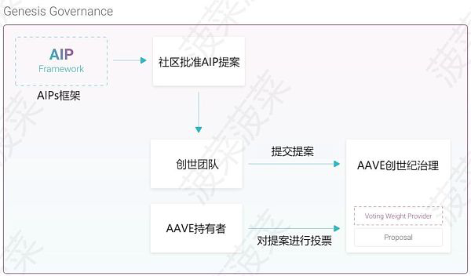

# Governance治理

* AAVE的Governance治理 
  * 概述 
    * AAVE协议由AAVE持有者以DAO的形式进行运营以及管理，根据持有者的AAVE以及stkAAVE的余额总和的比例获得治理权重 
  * 持有治理Token拥有两种权利 
    * 提案权 
    * 投票权 
  * Token持有者可以创建提案以及对提案进行赞成或反对的投票 
  * 提案 
    * 内容 
      * AAVE市场风险参数的变动 
      * 生态系统储备基金的激励参数 
      * 金库资金的分配 
      * 资产的添加、暂停或下架 
      * 协议机制调整 
    * 类型 
      * 图表
        * 
      * 文字 
        * 短执行（Short Executor） 
          * 短执行通常为协议参数的变更，资产列表的变更等 
        * 长执行（Long time lock） 
          * 长执行提案涉及到核心代码库的变更 
            * 二者之间提案所需要的时间以及票数等都不同 
    * 治理流程 
      * 图
        * 
      * 文字 
        * 当有人想提出提案时，通常需要在社区中收集反馈来获取前期的支持，在获得社区支持后创世团队（Genesis Team）会将提案提交给创世纪治理（Genesis Governance）程序 
    * 创世纪治理 
      * 是什么：以AAVE作为唯一投票资产的治理合约 
      * 核心组件 
        * AaveProtoGovernance 
          * 治理的核心组件，它存储于每个提交的提案相关的状态，允许治理Token持有者投票并允许执行批准的提案。该合约将拥有执行包含 Aave 生态系统所有引导操作的提案所需的所有权 
        * AssetVotingWeightProvider 
          * 定义投票者可以对提案进行投票的权重。仅允许治理Token投票，权重为 1（1 Token = 1 票） 
      * 后续流程 
        * 当提案提交至治理合约之后，AAVE的持有者就可以对提案进行投票了，与其他协议的治理系统不同的是，AAVE允许用户使用冷钱包进行投票，用户只需要使用冷钱包签署消息并使用不同的钱包转发即可投票，这使得一些在冷钱包中持有大量AAVE的用户更加便捷参与协议的治理无需将资产取出，唯一的要求是在提案期间代表权重的AAVE需要存放在签署消息的冷钱包中 
        * 这种方式有个缺陷就是由于不需要锁定Token只需签署消息即可，这样就会导致用户在多个钱包中使用相同的Token进行多次投票，为了避免这种情况 
        * 治理程序中存在一个投票挑战程序来验证投票的真实性，验证期可在以下情况下激活： 
          * 达到最短投票持续时间，并且选民超过法定人数 
          * 尚未达到最短持续时间，但投票已超过法定人数。在这种情况下，需要手动触发挑战期。  
        * 在验证期间，将会对每个参与投票的地址进行质询，该挑战动作会将每个不持有投票Token的地址的投票权取消，如果提案门槛因此被超过，那么投票期将会重新开始。 
      * 流程图
        * 
    * 评价 
      * 与 Maker DAO的“寡头治理”不同，AAVE的治理实现真正的 Decentralized 治理，用户不需要质押锁定AAVE也可以拥有治理权，并且AAVE的分布性使得没有一个个人或团体可以利用手中的治理权重决定任何一个提案。 
