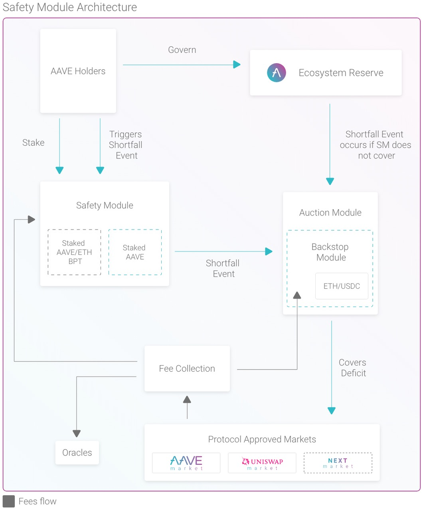
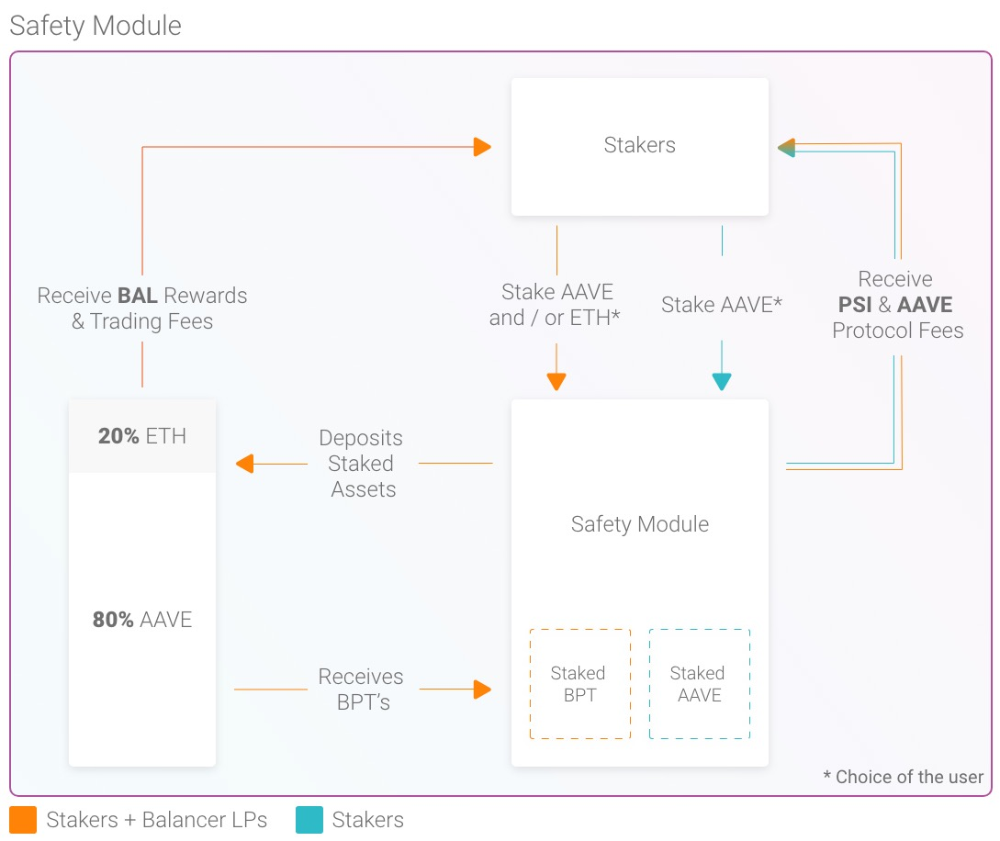
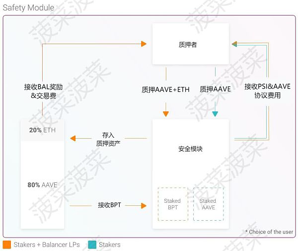
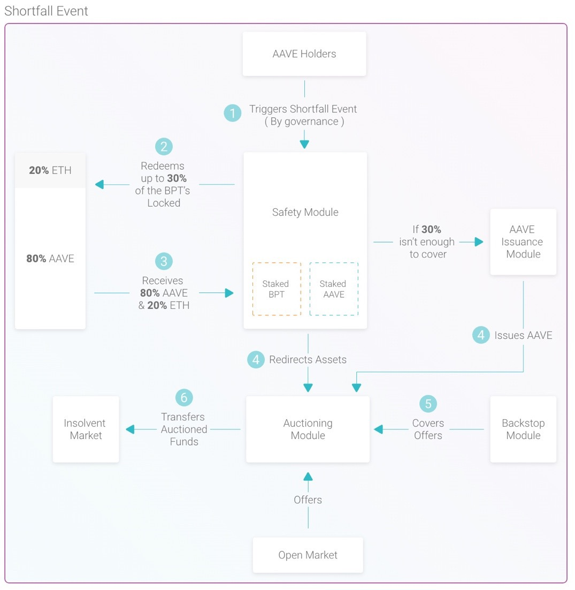
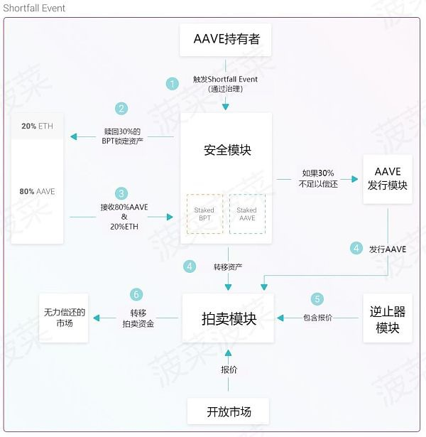

# Safety Module安全模块

* Safety Module 
  * 概述 
    * 保护Aave协议的主要机制是激励Aave持有者将令牌锁定到一个基于智能合约的组件中，该组件称为安全模块(SM)。在属于AAVE生态系统的流动性市场发生短缺事件时，锁定的AAVE将用作缓解工具。当出现赤字时，就会发生短缺事件。短缺事件发生的解释取决于协议治理投票，详见治理 
      * The primary mechanism for securing the Aave Protocol is the incentivization of AAVE holders to lock tokens into a Smart Contract-based component called the Safety Module (SM). The locked AAVE will be used as a mitigation tool in case of a Shortfall Event within the liquidity markets that belong to the Aave ecosystem. A Shortfall Event occurs when there is a deficit. The interpretation for the occurrence of a Shortfall Event is subject to the Protocol Governance vote, detailed in Governance. 
  * Architecture
    * 
  * Safety Module In Detail
    * 
    * 
  * Shortfall Events 
    * 
    * 
