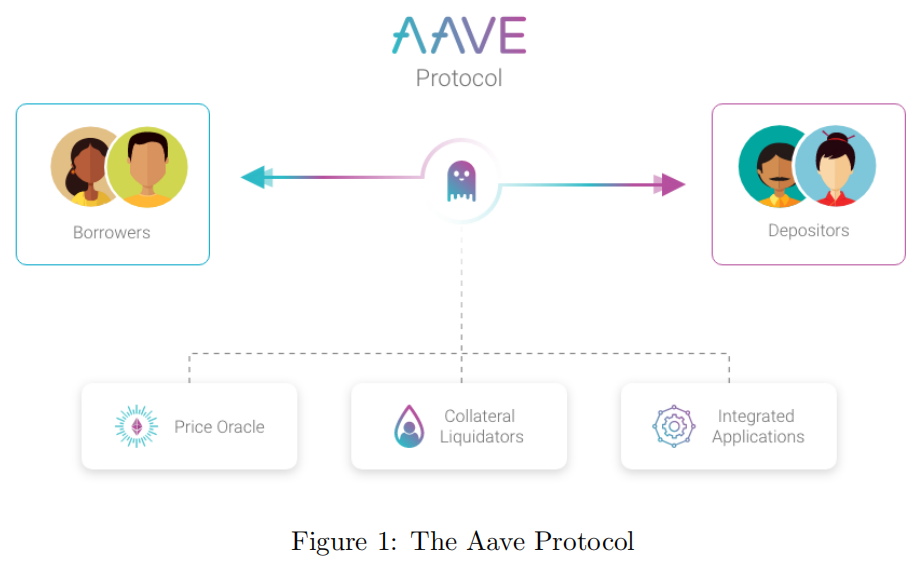
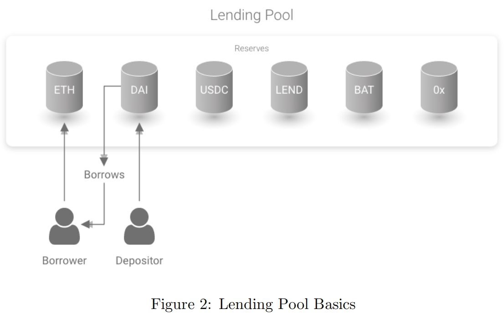
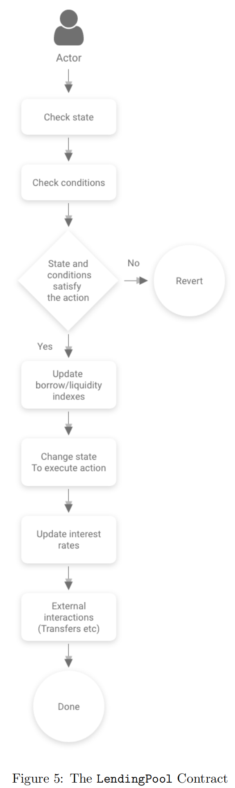

# AAVE v1

* AAVE借贷协议 v1 
  * Aave Protocol=AAVE协议 基本逻辑 
    * 之前是：ETHLend 
      * P2P点对点的去中心化的借贷策略 
        * 直接在lenders和borrowers直接撮合贷款 
    * 现在是：基于资金池的策略 
      * 同一个资金池 
        * lenders=放款人：存入加密货币=提供流动性，进入资金池 
        * Borrowers=借款人：从资金池中借款 
          * 但先要提供抵押物 = 存入加密货币 
      * 注意 
        * 和传统的P2P借贷不同，无需每个放款人和借款人的信息完全单独匹配 
        * 主要依赖于资金池 
    * 架构图 
      * V3
        * 
      * 包含内容 
        * Borrowers=借款人=借方 
        * Depositors=存款人=贷方 
        * Price Oracle=价格预言机 
        * Collateral Liquidators=抵押品清算人 
        * Integrated Applications=集成的应用 
    * 借贷 
      * 借贷流程图
        * 
      * borrow position 
      * 资金池=Pool = Reserve=保留资金？ 
        * 每个资金池有自己的 
          * 清算阈值 
      * 借款的利率有2种 
        * stable rate=稳定利率 
        * variable rate=可变利率 
    * 主要智能合约 
      * LendingPool 
        * 核心流程
          * 
        * LendingPoolCore 
          * 持有所有储备金和所有存款资产的状态 
            * holds the state of every reserve and all the assets deposited 
          * 处理基本逻辑(指数的累积，利率的计算…) 
            * handles the basic logic (cumulation of the indexes, calculation of the interest rates...) 
        * LendingPoolDataProvider 
          * 功能 
            * 在比LendingPoolCore更高的抽象层上执行计算，并为LendingPool提供数据 
              * performs calculations on a higher layer of abstraction than the LendingPoolCore and provides data for the LendingPool 
          * 包括 
            * 计算用户余额(借款余额、抵押品余额、流动性余额)的ETH等价物，以评估允许用户借多少钱和健康因素 
              * Calculates the ETH equivalent a user’s balances (Borrow Balance, Collateral Balance, Liquidity Balance) to assess how much a user is allowed to borrow and the health factor 
            * 聚合来自LendingPoolCore的数据，为LendingPool提供高级信息 
              * Aggregates data from the LendingPoolCore to provide high level information to the LendingPool 
            * 平均贷款价值比和平均清算比率的计算 
              * Calculate of the Average Loan to Value and Average Liquidation Ratio 
        * LendingPoolConfigurator 
          * 解释 
            * 提供LendingPool和LendingPoolCore的主要配置功能 
              * provides main configuration functions for LendingPool and LendingPoolCore 
            * LendingPoolConfigurator合约将被集成到Aave协议治理中 
              * The LendingPoolConfigurator contract will be integrated in Aave Protocol governance 
          * 包括 
            * 储备的初始化 Reserve initialization 
            * 储备配置 Reserve configuration 
            * 启用/禁用储备金借款 Enable/disable borrowing on a reserve 
            * 启用/禁用特定准备金作为抵押品的使用 Enable/disable the usage of a specific reserve as collateral 
      * InterestRateStrategy 
        * interstratestrategy合约保存更新特定准备金利率所需的信息并实现了利率的更新。每个储备都有一个特定的interstrategy契约。 
        * 具体来说，在基本策略契约DefaultReserveInterestRateStrategy中定义了以下内容: 
          * 基本可变借款利率Rv0 
            * Base variable borrow rate Rv0 
          * 利率斜率低于最佳利用率Rslope1 
            * Interest rate slope below optimal utilisation Rslope1 
          * 超出最佳利用的利率斜率Rslope2 
            * Interest rate slope beyond optimal utilisation Rslope2 
    * Governance=治理 
      * 协议的权限由LEND令牌控制。最初，Aave协议将与基于DAOStack框架的去中心化链上治理，将发展成为完全自主的协议。链上意味着所有的投票都是有约束力的:投票后的操作是硬编码的，必须执行 
      * 要理解治理的范围，重要的是要做出区分: 
        * Aave Protocol=AAVE协议 
          * Aave协议必然会发展，并将允许创建多个隔离的贷款池流动性、参数、权限和资产类型。 
        * Aave Lending Pool=AAVE借贷池 
          * 在池工厂更新发布之前，Aave借贷池是Aave协议的第一个池，且任何人都可以创建自己的池。 
      * 在Aave协议中，治理将在两个级别上进行 
        * Protocol’s Governance=协议的治理 
          * 协议的治理投票由LEND对与协议参数和相关的决策进行加权智能合约的升级。它可以与MakerDAO的治理进行比较，由利益相关者投票决定协议的当前和未来参数。 
        * Pool’s Governance=借贷池的治理 
          * 在池的治理中，你的投票是根据你在池流动性中所占的份额来加权的aTokens。投票涵盖了资产池的具体参数，如用作抵押品或借款的资产。在协议的治理的框架下，每个池都有自己的治理。 
