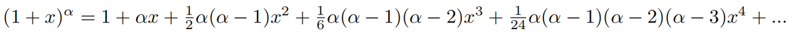
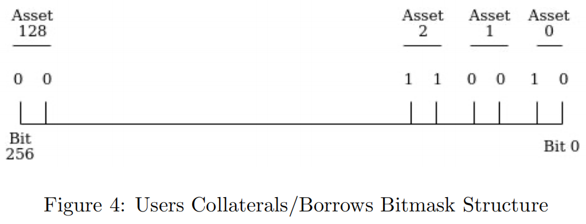
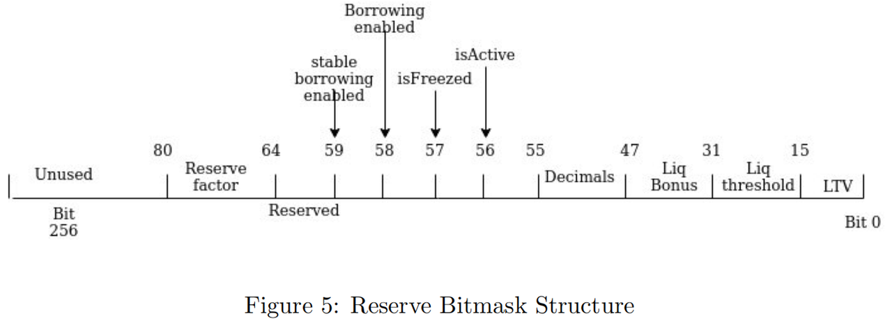

# Gas优化和改进

* AAVE V2 
  * Gas优化和改进=Gas optimisation and improvements 
    * pow函数实现 
      * 在最初的版本中，复利的计算依赖于使用Babylonian巴比伦方法实现的指数公式，导致更耗时和昂贵的执行。 
      * V2版本通过使用二项式展开(binomial expansion)近似该指数公式来优化执行成本，这在小基数下工作得很好。实现使用了如下的二项式展开
        * 
      * 函数calculateCompoundedInterest(MathUtils.sol, 第46行)实现了前三个扩展，给出了长达5年贷款期限的复利的良好近似值。这就导致了天然气优化带来的收益抵消了轻微的支付不足。 
      * 需要注意的是，对于可变和稳定借款，这种行为略有不同 
        * 对于可变借款，对任何借款人的任何动作都应计算利息 
        * 对于稳定借款，只有当特定借款人执行某项操作时才应计算利息，从而增加了近似的影响。不过，考虑到交易成本的节省，这种差异似乎是合理的 
    * 从WadRayMath和PercentageMath中移除SafeMath 
      * V1 WadRayMathlibrary在内部使用SafeMath来保证操作的完整性。经过深入分析，SafeMath在协议的关键领域产生了大量高成本，每次调用都要支付30的gas费用。这支持重构WadRayMath以删除SafeMath，这在某些操作上节省了10-15k的gas 
    * 用位掩码映射用户的贷款/存款 
      * 在最初的V1版本中，协议循环遍历所有有效的资产，以识别用户存款和贷款。这将导致高gas消耗和降低可扩展性——因为随着协议上列出的资产越来越多，提取/借款/偿还/清算资产的成本将会增加。考虑了两个改进的想法: 
        * 1. 对于每个用户，保留一个用作抵押品/借款的资产列表，每当用户存款/取款/借款/还款时更新。在计算整个系统担保时，而不是循环遍历所有支持的资产，函数calculateUserAccountData()可以针对特定用户的资产。 
          * 这种解决方案没有任何限制，尽管它更耗Gas——当考虑从列表中删除项目的成本时，检查每个aToken余额、稳定利率或可变利率的债务、用户是在存款、借贷还是两者兼而有之…… 
        * 2. 创建结构如图4所示的位掩码 
          * Users Collaterals/Borrows Bitmask Structure
            * 
          * 位掩码有256位大小，它被分成对的位，每个资产一个。这对的第一个比特表示资产是否被用户用作抵押品，第二个比特表示资产是否被用户借入。这个实现施加了约束: 
            * 只能支持128个资产，要增加更多，需要使用另一个uint256。 
            * 对于账户数据的计算，协议仍然需要查询所有列出的资产。 
          * 与基于列表的解决方案相比，它具有以下优点: 
            * 额外的资产只需要花费5k gas，而不是写在清单上的2万gas 
            * 极其廉价地验证用户的资产借款(0xAAAAA…!=0)或存款(配置=0) 
            * 通过获取代币/债务代币余额，立即访问正在存入/借入/两者的资产 
            * 在calculateUserAccountData()中，配置可以在开始时缓存并用于执行所有计算，从而大大节省了SLOAD 
      * 两种解决方案都进行了实施和测试，第二种解决方案更受青睐，因为128个资产限制提供了增长空间，而且考虑到Aave的多市场。 
    * 使用位掩码保留配置 
      * 还引入了一个位掩码来存储备用配置，如图5所示 
        * Reserve Bitmask Structure
          * 
      * 类似的封装可以通过使用uint32和布尔值来实现，位掩码受益于更高的gas效率，并且在一次更新多个配置时更加如此 
