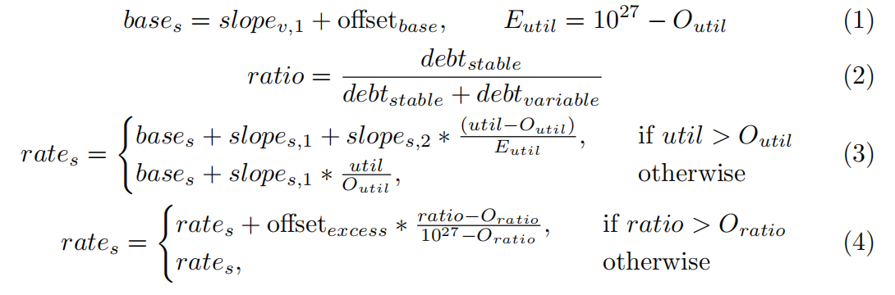

# AAVE v3

* AAVE V3
  * 去中心化
    * 治理：Controlled by Aave governance
    * 存储：an IPFS-deployed
    * 前端：open-sourced frontend 
  * 关键特性 
    * aToken
    * choice of stable or variable interest rates
    * credit delegation
    * 等等
  * AAVE V3的主要改进
    * 概述
      * improving user experience while offering increased capital efficiency with out sacrificing security 
    * 包括 
      * 资产利用率Capital efficiency 
        * 为流动性提供者产生更多收益 
          * Aave协议在多个网络中的总流动性接近200亿美元。目前，大部分流动性都闲置在协议的智能合约中，通过借款活动产生收益。尽管这种收益是稳定且安全的，但通过实施新的面向用户的功能，重复使用闲置资本而不增加偿债风险，可以增加收益。（请注意，这不包括将资产重新分配到其他协议进行“收益农场” yield farming——这通常会带来相当大的智能合约风险，并且不符合Aave作为一个0层DeFi协议的定位——其他协议经常将其资产分配出去以提高其收益。） 
        * 优化借款能力 
          * 在Aave协议的之前版本中，由于池模型内任何抵押品都可以用来借入任何“可借”资产，借款人在某些情况下面临着最大化其借款能力的挑战。因此，借款交易的风险参数设定得相当保守。 
        * 低效的底层网络 
          * 大部分供给到Aave协议的资产位于以太坊L1网络，该网络已饱和，并导致了高交易费用和用户体验的痛点。网络的低效也影响了预言机提交准确价格的能力以及响应时间的缩短。 
        * 聚合流动性方法 
          * 在Aave协议中，用户的总抵押品价值是通过聚合所有存入的抵押品的价值，并将总值规范化为某一基础货币（通常是ETH）来计算的。然后使用总抵押品价值来计算平均借款能力，该借款能力是所有单个资产的借款能力的加权平均值（更多详细信息请参见Aave白皮书，第5节）。资产的风险配置反映了总抵押品价值和总借入价值可能波动的事实，因此，设置得相当保守。这在许多情况下限制了借款人从其抵押品中获得的能力。例如，一个用户在提供稳定币的同时借入稳定币，其抵押品与借入资产之间的相对波动性较低，因此应该享有更高的抵押能力。 
        * 减少流动性隔离 
          * 新的流动性协议已经寻求通过启用独立池或独立对来提高抵押能力同时降低风险。尽管这可以提高某些资产的抵押能力，但实际上这促使了更多的流动性隔离（流动性提供者被迫在多个对/池中部署资产以匹配他们的风险偏好）和用户体验问题（借款人可能被迫将其抵押品分配到不同的池/对，以便借到他们需要的东西）。第2节更详细地分析了一些当前的方法和改进领域。新的流动性协议已经寻求通过启用独立池或独立对来提高抵押能力同时降低风险。尽管这可以提高某些资产的抵押能力，但实际上这促使了更多的流动性隔离（流动性提供者被迫在多个对/池中部署资产以匹配他们的风险偏好）和用户体验问题（借款人可能被迫将其抵押品分配到不同的池/对，以便借到他们需要的东西），并更详细地分析了当前方法及其缺陷。 
      * 协议安全Protocol safety 
        * 风险管理对于流动性协议至关重要，需要缓解智能合约风险和流动性风险。对于智能合约风险，需要仔细审查并审核任何代码更新和治理提案的审计过程。这主要是一个线下/协调问题，管理这种风险通常涉及在处理代码/智能合约升级时保持关键任务文化。流动性风险更为微妙，涉及仔细评估市场条件以调整参数配置，以及对社区提出的资产上市提案进行适当的尽职调查（Aave社区开发并维护了Aave风险框架）。 
        * 当前Aave协议迭代中的风险配置不幸地受到限制。尽管可以即时调整借款能力（LTV）和维护保证金（清算门槛），但协议可以从增加防御措施中受益，以防止无限制增发或操纵预言机等可能的攻击。 
      * 去中心化Decentralization 
        * 协议管理完全去中心化，因此由AAVE代币持有者（“Aave治理”）控制。Aave治理在协议配置的某些方面扮演着守门人的角色（例如，上市新资产）。虽然这对于确保协议的安全性很重要，但对于希望通过上市代币来获取Aave协议流动性的团队和项目来说，这在某种程度上是限制性的。 
      * 用户体验User experience 
        * 在一个多链和多个汇总网络的世界中，允许流动性在不同链之间无缝流动变得越来越重要。虽然Aave协议目前已部署在多个具有重要总锁定价值（TVL）的网络上，但用户没有无缝的方式将流动性从一个网络上的Aave实例移动到另一个网络上的Aave实例。 
    * 具体方案 
      * 独立流动性对=Isolated liquidity pairs 
        * 这种方法使用了通常定义为“独立对”的方式——在这种对中，借款人只能使用特定的抵押品借入一种资产。与Aave V2的聚合池方法相比，这有一些优势： 
          * 减少了gas费用 
            * 总体而言，交互的gas足迹减少了，因为状态管理较少，且不需要迭代用户借入和提供的所有资产。 
          * 无需许可的上市新资产 
            * 任何资产都可以在非常有限的风险管理下被上市。 
        * 然而，这种设计也影响了协议扩展能力的能力。 
        * 极端的流动性隔离 
          * 流动性现在严格按抵押品隔离，这意味着供应商可能被迫将他们的资本分散到多个池中以追求最高的收益。尽管通过在协议之上构建的工具可以聚合提供的加密资产，这减少了用户微调其风险档案的能力，至少部分地使这种方法的一个主要优势失效。这也意味着，对于每个新对，都需要为借款人建立流动性，以便他们能够借入新上市的资产。 
        * 借款人的糟糕用户体验 
          * 在Aave协议中，借款的行为是直接的，因为提供的抵押品和借入的加密资产都被聚合了。这提供了非常简单的用户体验：借款人只要提供所需的过度抵押，就可以立即借入任何资产，而只需要管理一个位置。使用独立对时，如果借款人想借入多种资产，即使使用单一形式的抵押品，也必须同时与多个对进行交互。这导致必须同时管理许多位置。这可以通过在协议之上构建解决方案来缓解，但它减少了流动性隔离的影响，并且也使得主要优势之一（燃气成本）失效。流动性隔离通常也意味着更高的平均借款利率。 
        * 倾向于更高风险的资产 
          * 通常，使用风险资产作为抵押品的借款人（在其他流动性协议上）愿意支付比使用更安全资产的借款人更多的费用。这种用户行为可能允许在允许无许可资产上市且没有任何债务上限的协议中进行潜在的攻击。例如，用户可能不当地向一个新创建的池供应稳定币，该池中有一个波动性或其他不稳定的资产，通过人为地借用该资产，增加了质押者的吸引力。 
      * 独立流动性池=Isolated liquidity pools 
        * 孤立池定义了一种本质上是Aave和孤立对之间的混合体的架构，例如，一个无需许可的协议，用于创建带有特定资产和自定义风险管理配置的独立市场。这种方法类似于Aave在2020年开创的首个Uniswap池，用于借入Uniswap V1 LP资产。拥有多个市场使用户能够将风险分散到资产群中，减少潜在资产失败的影响，而不牺牲用户体验，并在流动性隔离方面作出一些妥协。 
        * 由于其特定架构，这种方法遭受一些与孤立对相同的问题。虽然不那么严重，但流动性隔离仍然很重要——许多池子难以吸引流动性。总锁定价值（TVL）也通常偏向于更高风险的资产。 
  * AAVE V3概览 
    * 概述 
      * Aave V3的设计源于对该协议及其生态系统发展的深思熟虑的分析。V3增强的功能为新的使用案例提供了可能，这将激发用户和开发者的创新浪潮。Aave V3在所有前述类别中进行了改进——资本效率、安全性、去中心化、用户体验——同时提供新的功能，以利用卷积技术和竞争激烈的L1生态系统的发展。 
    * 资金效率和用户体验改进 
      * Portal
      * E-Mode
      * Isolation Mode
    * Risk Management
    * 去中心化 
      * Aave V3 引入了资产上市管理员（Asset Listing Admins）。上市管理员是一个特定的角色，可以通过 Aave 治理授予，允许采用除了在 Aave V2 中看到的链上投票之外的不同资产上市策略。这将允许开发者创建定制的资产上市策略，旨在实现真正的无需许可的资产上市 
        * Aave V3引入了一个新的系统角色——ASSET_LISTING_ADMIN_ROLE——它可以被Aave治理授予，允许管理员为每个资产列表创建和设置自定义的资产列表策略。 
    * [Multiple Rewards and Claim](../../version/v3/multiple_rewards_claim.md)
    * 其他特性 
      * 涉及代币转移的所有功能（供应、还款）现在支持 EIP 2612 许可（这对 L2 尤其重要）。 
      * EIP 712 签名用于信用授权（合约不再需要请求用户交易）。 
      * 使用 aTokens 还款：允许借款人使用 aTokens 而不是基础资产进行还款。 
      * 闪电贷的许可列表：治理可以允许实体访问免费的即时流动性（免除闪电贷溢价）。 
      * 清算的协议费（可配置）。 
      * 即时流动性的协议费（可配置）。 
      * 简化的闪电贷：新的 flashloanSimple() 函数能够减少高达 20% 的气体消耗，与标准的即时流动性功能相比（仍然可用）。 
      * 价格预言机逻辑重构，以推广基础资产的计算（不再仅限于 ETH）。 
      * Gas优化：尽管增加了所有新功能，所有功能的气体成本平均下降了约 20 * 25%。 
      * 代码重组，更加模块化。 
      * 智能合约重构大大减小了代码体积（未来更改的余地更大）→ 高达 100K 的优化器运行次数！ 
      * 新的利率策略优化了稳定利率的计算（不再需要平均稳定借款利率的预言机） 
        * 详见：https://governance.aave.com/t/base-stable-rate-oracle-update-and-improvements-in-aave-v2/1879 的第 4.4 节 
  * 移除稳定利率预言机 
    * 新的利率策略实施了一种算法方式来管理稳定利率，如治理论坛上所讨论的那样。当前的实施方案取消了借贷利率预言机，转而优化稳定利率与某个确定的最优稳定/变动债务比率相对应，该比率由利率策略定义，并将最小稳定债务年化利率设定为slope(v,1) + offset(base)。 
    * 例如，对于一个稳定偏移为2%的资产，在其90%的最优利用率下达到4%的变动利率，最小稳定利率将为6%。然后使用斜率slope(s,1)和slope(s,2)计算利率，并且如果稳定/变动债务超出最优，还会进一步以offset(excess)为上限进行偏移。 
    * 要计算稳定利率，设O(util)和O(ratio)分别为最优利用率和最优稳定至总债务比率常数，然后按下述方式计算稳定利率： 
      * 
  * Aave接口 
    * Aave接口以分散的方式托管在IPFS上。Aave将以下DNS名称映射到Cloudflare IPFS网关: 
      * https://app.aave.com
        * 将始终指向禁用测试网络的最新主IPFS哈希值 
      * https://staging.aave.com
        * 将始终指向所有网络启用时最新的主IPFS哈希值 
  * L2层优化 
    * L2上的主要交易成本来自于calldata。为了尽量减少这一成本，Aave V3在Arbitrum和Optimism上使用了略有不同的L2合约，这些合约压缩了传递给Pool方法的信息。 
    * 以下是为L2优化引入的合约： 
      * L2Pool：一个为L2优化的用户面向方法的合约，接受字节编码的输入参数。 
      * CalldataLogic：用于解码传递给L2Pool的byte32参数的库合约。 
      * L2Encoder：一个辅助合约，拥有视图方法，用于编码数据以传递给L2Pool。 
    * 在L2Pool.sol中未公开的Pool方法（如flashLoan, setUserEMode等）在L2上与协议的其他版本相同 
    * 详见 
      * https://docs.aave.com/developers/core-contracts/pool
      * https://docs.aave.com/developers/getting-started/l2-optimization/l2pool
      * https://docs.aave.com/developers/getting-started/l2-optimization/l2encoder
  * 从v2迁移到v3 
    * 为了将您的资产从V2市场转移到V3市场，您可以使用迁移工具，该工具可以帮助并指导您在V2仪表板上的单个交易中迁移您的头寸。要找到迁移按钮，请前往您拥有资产的任何V3版本V2市场中的仪表板，并单击市场名称右侧的“Migrate To V3”。 
    * 你所需要做的就是: 
      * 选择要迁移的供应和借款账户 
      * 点击“预览tx并迁移” 
      * 签署批准每个职位 
      * 提交迁移事务 
    * 如果您有新开账户，迁移工具将通知您V2和V3上的新健康因子。请注意这一新的健康因素，以减轻清算风险。 
    * 每个供应位置都需要批准迁移合同才能转让aToken，每个借款位置都需要批准信用委托，以便迁移合同代表您在V3中执行借款。这两种审批都可以通过签名消息或审批事务执行。如果您在V2中有大量的借存资产，建议您分批迁移。建议在单个迁移事务中迁移不超过5个资产。没有必要将资产从V2迁移到V3, V2契约将继续运行并保持可访问性。迁移工具使用信用委托和闪贷的组合来迁移头寸。该工具使用闪贷和信用委托，在V2上偿还债务，在V3上代表用户借入相同的头寸和金额，将用户债务留在V3上。 
    * 如果您想查看技术实现，您可以在这里找到迁移工具契约。 
      * https://github.com/bgd-labs/V2-V3-migration-helpers/blob/main/src/contracts/MigrationHelper.sol
