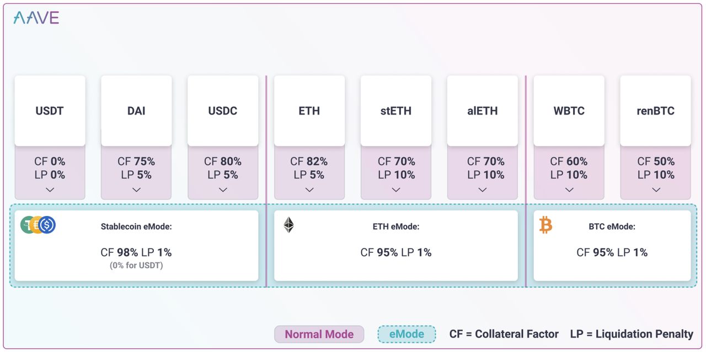

# E-Mode

* AAVE协议V3：`E-Mode` = `eMode` = `Efficiency Mode` = `High Efficiency Mode` = `高效率模式`
  * 背景 
    * 高效模式功能旨在在抵押品和借入资产价格相关联时，尤其是当两者都是同一基础资产的衍生品时，最大化资本效率。稳定币通常锚定于特定的基础资产（例如，一美元），而严重脱锚的情况很少见。以太坊及其衍生品（如 stETH、sETH、alETH 等）的表现与其基础资产（ETH）类似。在这些情况下，有可能授予非常高的抵押权力。 
    * 在 Aave 协议的原始设计中，抵押品价值和借入资产通常被标准化为基础货币（ETH 或 USD），并且链上无法知道哪些抵押品支持哪些借入资产，这使得提高抵押效率变得非常困难。 
    * E-模式引入了一种资产分类，将 Aave 协议上所有列出的资产放在一个特定的类别中；同一类别的资产通常在价格上高度相关。正确的分类不能在链上强制执行，需要由管理协议的实体（通常是 Aave 治理）维护。 
    * eMode还提供了为特定类别引入特定价格的可能性 
    * 用户可以有意选择借入一个特定的类别，并且当使用属于同一类别的抵押品时，可以运用高额的抵押权力。 
    * E-模式还提供了为特定类别引入特定价格预言机的可能性。例如，对于只定义了 renBTC 和 WBTC 的类别，当用户处于 BTC E-模式时，可以为它们两者使用 BTC/USD 预言机。这将进一步减少不希望的清算风险，因为它消除了预言机的不同步性（例如，在 BTC 价格急剧下跌的情况下，WBTC/USD 和 renBTC/USD 预言机可能会在略微不同的时间更新，因为它们是异步的；这可能导致不希望的清算）。特定类别的预言机为协议引入了更多风险，因为如果其中一个资产未能保持其价值（例如由于协议黑客攻击或特定衍生品的底层问题），可能会导致资不抵债。Aave 治理需要仔细评估每个资产和每个类别的情况，决定是否使用特定类别的预言机。基于上述所有原因，E-模式更适合更快的网络（尤其是 rollups），在这些网络中，预言机可以更高效，且不会因高交易成本而引发清算。 
  * 概述 
    * 高效率模式（E-Mode）允许借款人从他们的抵押品中获取最高的借款能力 
      * 当提供的资产和借入的资产价格相关时，特别是当两者都是同一基础资产的衍生品时，高效模式或eMode允许借款人从抵押品中提取最高的借款能力，与美元挂钩的稳定币) 
  * 目的 
    * 旨在当抵押品和借入资产的价格相关时，实现资本效率最大化 
  * 效果=用途 
    * 高杠杆外汇交易=High leverage forex trading 
    * 高效收益农业(例如，存入ETH投资衍生品以借入ETH) =Highly efficient yield farming (for example, deposit ETH staking derivatives to borrow ETH) 
    * 多元化风险管理=Diversified risk management 
  * category类别 
    * 由Aave Governance设置的RISK_ADMINS和POOL_ADMIN，最多可以配置255个eMode类别：EModeCategory 
  * 每个分类（EModeCategory）具有以下风险管理参数 
    * LTV=贷款价值比 
    * 清算阈值=Liquidation threshold 
    * 清算奖金=Liquidation bonus 
    * 自定义价格预言机（可选） 
  * 细节 
    * 在Aave V3上列出的所有资产都可以通过RISK_ADMINS或POOL_ADMIN设置为任何预先配置的eModeCategory 
    * E-Mode 允许借款人限制自己只借入属于某一特定类别的资产（例如，稳定币）。当这种情况发生时，如果用户提供同一类别的资产作为抵押，借款能力（LTV）和维持保证金（清算门槛）将被 E-Mode 类别配置重写，以提高资本效率。请参见图1，其中有多个类别的示意图。 
    * 在V3中，Aave协议可以支持最多255个E-Mode类别，使得如下新的使用案例成为可能： 
      * 高效的收益农场（例如，存入ETH抵押衍生品来借入ETH） 
      * 多样化的风险管理 
  * 举例 
    * Aave 协议定义了 E-Mode 类别 1（稳定币）为：97% 的贷款价值比（LTV），98% 的清算门槛，以及2% 的清算奖励，不需要自定义价格预言机。 
    * 1. 用户选择 E-Mode 类别 1（稳定币） 
      * 图1：展示三个 E-Mode 类别（稳定币，以太坊，比特币）的插图
        * 
    * 2. 用户提供 DAI（通常具有 75% 的 LTV） 
    * 3. 用户现在被允许借入其他稳定币（包括 DAI），借款能力由 E-Mode 类别定义（97%）。因此，用户的资本效率提高了22%。请注意，用户仍然被允许提供其他资产并将它们用作抵押品，但只有属于用户选择的相同 E-Mode 类别的抵押品将拥有增强的风险参数。 
  * 不变量Invariants 
    * 类别0 
      * 类别 0 被保留为默认的非 eMode类别。在Aave V3中列出的所有资产，默认都是类别0(这表示标准操作模式) 
    * 进入E-模式 
      * 用户只有在所有借入的资产都在选定的类别中时，才能进入 E-模式（类别 != 0）。 
    * 退出E-模式 
      * 用户只有在退出 E-模式不会使其头寸资不抵债（HF ≥ 1）时，才能退出 E-模式（设置类别为 0）。 
    * 用户借款 
      * 在 E-模式下的用户只能借入选定类别的资产。用户可以使用任何资产作为抵押，但只有同一 E-模式类别的资产才能享受更高的抵押率。 
    * 资产添加 
      * 只有在 E-模式类别的贷款价值比（LTV）和清算门槛高于资产的默认非 E-模式风险参数时，授权实体（风险或资金池管理员）才能将资产添加到 E-模式。 
    * 资产移除 
      * 授权实体（风险或资金池管理员）可以将资产从 E-模式中移除。这可能会导致一些用户的资金状况不足，进而发生不希望的清算（参见第 4.7 节）。按设计，借用已从 E-模式类别中移除的资产的用户不会受到影响。那些仍在 E-模式中的用户在移除后将无法再借用该资产 
  * 工作原理 
    * 如果用户向协议提供了流动性，则默认将用户的eMode类别设置为0。 
    * 该协议允许用户将用户eMode类别设置为PoolConfigurator配置的任何eModeCategories，前提是以下条件成立: 
      * 用户的所有借款资产都在所选类别中。 
      * 改变eMode不会让用户的位置没有担保 
