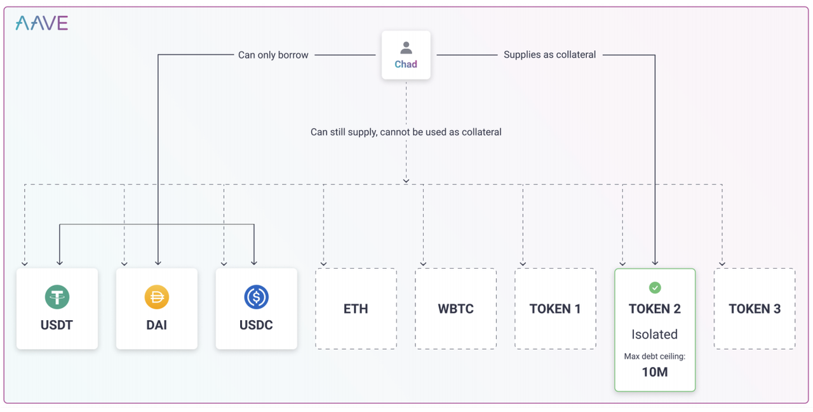
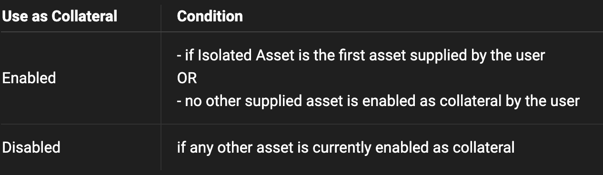

# Isolation Mode

* AAVE协议V3：Isolation Mode=隔离模式 
  * 背景 
    * 在包括 Aave V2 在内的当前代流动性协议中，当一个新资产被上市时，整个流动性池将对其暴露，这意味着使用新抵押资产的用户可能能够借用全部可用流动性。这极大地限制了向 Aave 协议添加新资产的能力，因为每一个新资产都会增加流动性和偿债能力风险。隔离模式为此问题提供了解决方案。 
    * 当 Aave 管理层在 Aave 协议上列出一项资产时，使用它作为抵押品的借款人立即可以访问整个协议的流动性。这使得列出新资产变得复杂，并降低了借款人的资本效率。因此，V3 引入了隔离模式，其灵感来自 MakerDAO 的风险暴露管理方法。 
  * 概述 
    * 隔离模式是一个新的风险管理参数，允许协议限制用作抵押品的新资产的风险。在隔离模式下，V3上列出的新资产只能借用已被允许借用的稳定币。 
    * 隔离模式允许将新资产列为隔离资产，该资产具有特定的债务上限，并且只能用于借入已被Aave治理配置为可在隔离模式下借入的稳定币。独立代表的债务上限是可以以抵押品为抵押借入的最大美元金额。 
  * 细节 
    * 现在，资产可以（如果 Aave 管理层投票同意）被列为“隔离”。提供隔离资产作为抵押品的借款人不能提供其他资产作为抵押（尽管他们仍然可以提供以获得收益）。只有被 Aave 管理层允许在隔离模式中借入的稳定币可以被使用隔离抵押的用户借用，直到指定的债务上限。 
    * 隔离模式允许协议将资产列为隔离资产；隔离资产有特定的债务上限（代表可以针对抵押品借入的最大美元金额，精确到小数点后两位）。使用隔离资产作为抵押的借款人只能使用该特定资产作为抵押，不能启用任何其他资产（包括其他隔离资产）。使用隔离资产的用户仍然可以提供其他资产以产生收益。 
    * 在隔离模式中可以借用的资产由标志“BORROWABLE IN ISOLATION”指示，并且应该是美元稳定币，尽管设计允许选择任何计价单位的资产用于隔离借用。在隔离模式中可借用的资产需要属于同一家族，否则债务上限的计算将不一致；这种一致性无法在智能合约级别强制执行，当允许资产在隔离中被借用时，治理者应该小心谨慎。 
    * 新的资产可以在Aave协议V3中被列为隔离资产。提供单独资产作为抵押品的借款人不能提供其他资产作为抵押品(尽管他们仍然可以提供以获取收益)。使用隔离抵押品的借款人只能借到由Aave治理配置为可在隔离模式下借款的稳定币，上限不超过指定的债务上限。 
    * 在实时仪表板上查看债务上限和可借款隔离模式参数。 
  * 举例 
    * 图2：用户以 $Token2 作为抵押品并借入稳定币的示意图
      * 
    * 在图2中，用户正在提供 $TOKEN2 作为抵押品。$TOKEN2 是一种隔离资产，最大债务上限为1000万美元。因此，用户将被允许借入高达1000万美元的 USDT、DAI 和 USDC（在这个例子中，这是隔离模式中允许借入的唯一三种资产），并且不被允许激活任何其他资产作为抵押品（用户仍然可以供应以太坊，例如，用于产生收益）。用户可以随时通过禁用 $TOKEN2 作为抵押品（只要它不导致清算）来退出隔离模式。当 Aave 管理层决定移除债务上限时，$TOKEN2 可以退出隔离模式。这将来允许真正无需许可的列名，具备风险管理。 
  * 不变量Invariants 
    * 隔离资产 
      * 任何债务上限大于 0 的资产都是隔离资产。 
    * 添加隔离资产 
      * 当没有提供流动性时（通过 checkNoSuppliers() 强制执行），资产才能被配置为隔离资产。 
    * 隔离抵押 
      * 用户提供隔离资产作为抵押将只被允许使用该资产作为抵押；在其他任何情况（供应、转移、清算、设置为抵押）中，都不应该可能启用非隔离资产作为抵押。 
    * 供应隔离资产 
      * 供应其他资产并将其用作抵押的用户仍然可以供应隔离资产以产生收益。当用户已经供应了其他非隔离资产并已将这些资产启用为抵押时，绝不应该可能启用隔离资产作为抵押。 
    * 退出隔离模式 
      * 用户可以通过禁用隔离资产作为抵押来退出隔离模式。鉴于隔离资产的性质，这只能在用户没有借款的情况下发生。 
    * 从隔离模式中移除资产 
      * 授权实体可以在任何时候将资产从隔离模式中移除。 
    * 债务上限 
      * 当达到隔离债务上限时，应禁止用户借款（债务上限不包括随时间累积的利息，仅包括借入的本金）。 
  * 供应隔离资产 = 如何进入隔离模式?
    * 用户可以像使用池中的supply()方法提供任何其他资产一样提供隔离资产。但是，在提供隔离资产时的默认行为可能会根据以下条件而变化
      * 
    * 如果用户启用了其他资产作为抵押品，他们仍然可以提供隔离资产以获取收益，但不能将其用作抵押品
    * 隔离模式仅对治理投票通过的某些资产启用。不能使用非隔离资产作为抵押品进入隔离模式。在成功进入资产隔离模式后，您只能在一定的债务上限内借入稳定币。
  * 隔离模式中借贷
    * 使用隔离资产作为抵押品的借款人只能使用该特定资产作为抵押品，并且只能借用在隔离模式下可借贷的资产，即在储备配置中设置BORROWABLE_IN_ISOLATION_MASK位。
    * 隔离模式下的借款人不能启用任何其他资产，包括其他被隔离的资产作为抵押品 
  * 退出隔离模式 = 如何退出隔离模式?
    * 若要退出隔离模式，您需要禁用已提供的担保隔离资产。
    * 用户可以通过禁用隔离资产作为附属来关闭隔离模式。只有在用户没有未偿债务的情况下才能这样做。用户必须在Pool中使用return()方法。他们必须在退出隔离模式前还清所有债务
