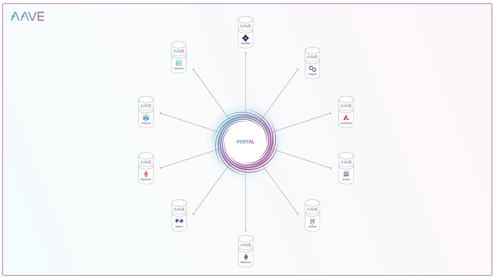
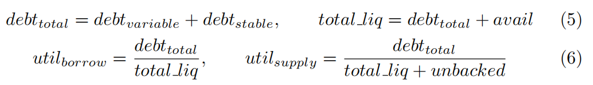
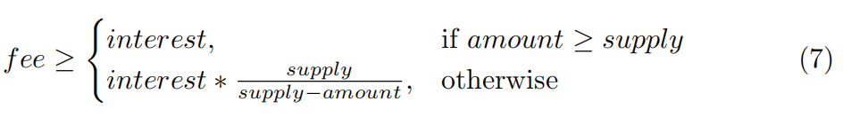

# Portal

* AAVE协议V3：Portal = 门户 
  * 作用：资产跨链（AAVE的不同的市场Market）流动 
  * 概述 
    * 允许用户在不同区块链网络上的各种V3部署之间无缝移动资产。这意味着用户提供的流动性可以从一个网络转移到另一个网络，只需在源网络(例如以太坊)上燃烧aToken，同时在目标网络(例如Polygon)上铸造它们 
    * Aave协议V3允许经过批准的网桥在源网络上烧掉aToken，同时在目标网络上立即铸造aToken。然后，可以将基础资产以延迟的方式提供给目标网络上的Aave，方法是在资产通过桥接器移动后将其传递到池中
      * 
  * 相关角色 
    * approved BRIDGE=授权的桥 
      * Bridging protocol具体实现 
        * Connext 
        * Hop Protocol 
        * Anyswap 
        * xPollinate 
  * 附加特性 
    * 为了支持Portal，协议需要以下三个附加特性: 
      * 铸造无担保令牌 
        * 允许具有BRIDGE角色权限的地址将无担保令牌铸造到onBehalfOf地址。 
      * 支持无担保代币 
        * 允许具有BRIDGE角色权限的合约以一定数量的基础资产支持当前无担保的代币并支付费用。 
      * 白名单桥 
        * 允许桥角色管理员添加/删除BRIDGE_ROLE的地址 
  * 详解 
    * Portal功能可用于允许提供的资产在不同网络上的Aave市场之间无缝流动。 
    * Portal 代表了一组新的核心功能，可用于允许供应的资产在不同网络的 Aave 市场之间无缝流动。在高层次上，这个功能非常简单：协议利用 aTokens 的独特锚定设计，在源网络上销毁 aTokens 同时在目的网络上铸造它们。这使得以一种延迟的方式供应资产成为可能，其中底层加密资产在通过规范链桥后被供应到 Aave 协议。 
    * Portal 代表一组核心功能，这些功能可以用来允许提供的资产在不同网络的 Aave 实例之间无缝流动。从高层次来看，这个功能本身非常简单： 
    * Aave 协议利用 aTokens 的独特设计，在源网络上销毁 aTokens，同时在目的网络上立即生成它们。然后，底层资产可以通过桥梁移动后延迟提供给目的网络上的 Aave，传递给池子。这对目的网络上市场的利率计算和总体安全性有多种影响。 
    * 从设计上看，协议级别几乎不需要任何功能就可以支持多种非常不同的门户实现。 
    * 协议只需要三个额外功能 
      * i) 铸造无担保的 aTokens 
      * ii) 为无担保的 aTokens 提供担保 
      * iii) 对希望使用这些功能的合同实施白名单机制。 
    * 除了这些功能外，还需要对每个储备的无担保金额进行额外的内部核算，以及对利率计算的更新。 
    * 请注意，铸造无担保的 aTokens 不会影响借款人的使用率，因为没有提供额外的流动性（util(V2) = util(borrow)），然而，必须在供应使用中考虑这一点，因为无担保的 aTokens 正在累积利息。为了适应这种情况，我们分别计算借款和供应两侧的使用率如下： 
      * 
    * 如方程 6 中所示，增加无担保价值将降低供应利用率，从而降低流动性提供者所赚取的利息，因为他们被铸造的代币稀释了。为了抵消这种利息稀释，无担保资产的支持支付了一笔累积到流动性指数的费用。这个费用应该覆盖由铸造代币所赚取的利息（注意，累积到流动性指数的利息也将一部分利息重定向到铸造的代币），因此，为了抵消在一定金额上所赚取的利息，它应满足： 
      * 
    * 虽然利率计算是核心协议的一部分，但为了覆盖无担保金额和费用所需的协议费用的计算来自核心协议之外。由于在协议级别不强制执行延期供应（通过 backUnbacked）和费用计算，管理者在批准桥接（端口）访问 Portal 功能时应谨慎。为了防止过度铸造无担保 aTokens 的潜在风险，可以为每个资产指定一个 unbackedMintCap。 
  * 举例 
    * 考虑这样一个场景:用户想要将资金从以太坊转移到L2或另一条链上(例如 Arbitrum, Avalanche): 
    * 用户将 bridge tx 提交给经过验证的桥接协议(例如Connext)，并在tx被挖掘后立即访问目标链上的资金 
    * 在幕后，桥接协议: 
      * 在目标链上将无担保的aToken铸币到中间合约，然后立即提取并将基础资产转移给用户。 
      * 批量处理多个桥tx，并实际将基础资产移动到L2 
      * 之后，一旦L2上的资金可用，L2上的桥接合约(即在Aave V3上具有BRIDGE权限)将基础资产和费用提供给Aave池，以支持先前制造的无支持的aToken代币 
    * 利用这个特性有3个部分: 
      * 批准BRIDGE角色的合同 
        * `function addBridge (bridge)`
          * 由于只有添加到BRIDGE角色成员列表中的合约(地址)才能跨Aave V3市场移动提供的流动性，因此Aave治理必须通过ACLManager向经过验证的桥接合约授予所需的权限/角色。 
            * 利率计算是核心协议的一部分，但计算延迟供应以覆盖无担保金额和协议费用并不是核心协议强制执行的。因此，政府在批准这些桥梁时必须谨慎行事。 
      * 在目的地网络上立即获得流动性 
        * `function mintUnbacked (asset, amount, onBehalfOf, referralCode)`
          * 具有BRIDGE角色的契约可以通过调用Pool.sol中的mintUnbacked立即跨网络访问Aave V3中提供的资产。onBehalfOf指定的地址将访问相应数量的token。 
            * 为了防止过度铸造无担保代币的潜在风险，每个资产都指定了一个unbackedMintCap 
      * 通过桥后移动资金的流动性 
        * `function backUnbacked (asset, amount, fee)`
          * 一旦基础资产通过跨链桥转移到目标网络，就可以通过调用pool.sol中的backUnbacked将其与费用一起提供给目标网络上的Aave V3池。 
            * 支付给协议的金额和费用由BRIDGE角色的治理投票决定。 
