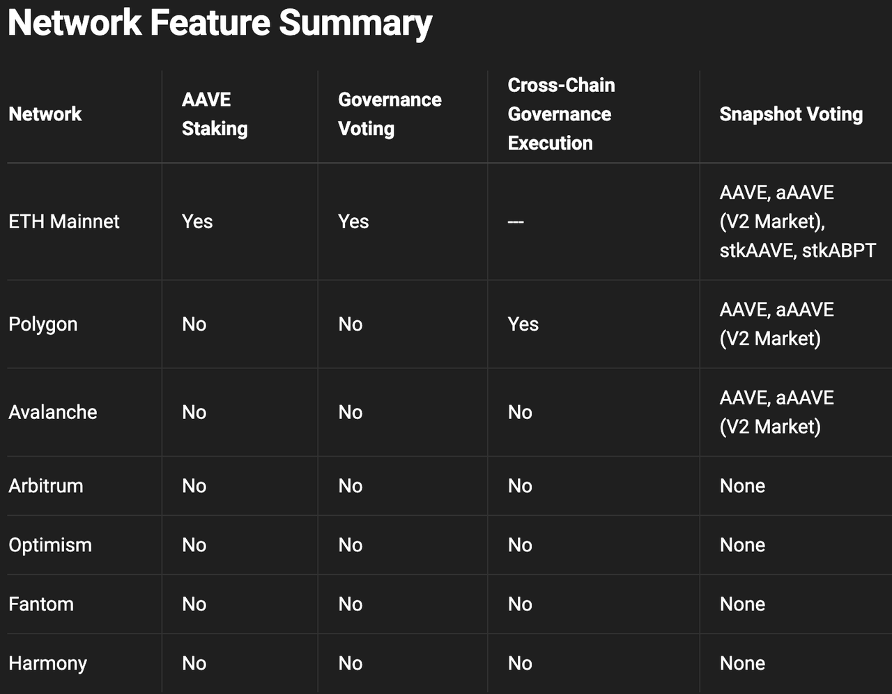
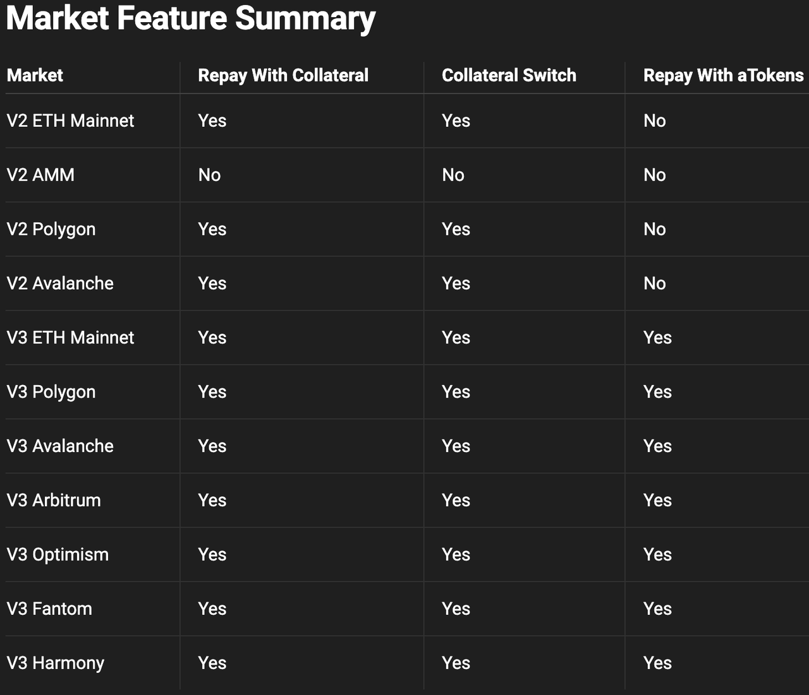

# 协议特性

* AAVE v3：协议特性=Protocol Features 
  * 概述 
    * Aave协议提供的功能可能仅在选定的网络或市场中可用。下面的指南给出了所有Aave Protocol部署中每个特性可用性的细分。 
    * Network网络特性
      * 
    * Market市场特性
      * 
  * 以抵押品偿还 
    * 概述 
      * 抵押偿还功能允许借款人使用协议内提供的流动性偿还其借入的资产。 
      * 该特性是通过ParaSwapRepayAdapter启用的。用户必须首先批准合同才能提取attoken以成功偿还抵押品。 
        * https://github.com/aave/aave-v3-periphery/blob/master/contracts/adapters/paraswap/ParaSwapRepayAdapter.sol
    * 支持的市场 
      * V2 Ethereum Main 
      * V2 Polygon 
      * V2 Avalanche 
      * V3 Polygon 
      * V3 Avalanche 
      * V3 Fantom 
  * 抵押物切换 
    * 概述 
      * 抵押物切换功能允许用户将一种资产类型的供应流动性切换到另一种资产类型，而无需单独的提取和供应交易(例如，在单个交易中将aUSDC切换到aDAI)。 
      * 附属开关特性是通过ParaSwapLiquiditySwapAdapter.启用的。用户必须批准合约才能提取attoken，以便成功切换流动性。 
        * https://github.com/aave/aave-v3-periphery/blob/master/contracts/adapters/paraswap/ParaSwapLiquiditySwapAdapter.sol
    * 支持的市场 
      * AAVE V3的所有的市场 
  * 用ATokens偿还 
    * 概述 
      * 用ATokens偿还是一个新的Aave协议V3原生功能 
      * 它允许用户用池中相同资产类型的流动性来偿还借来的资产 
        * 允许用户在基础借款资产被锁定在Aave流动性池的情况下用attoken偿还。 
      * 示例 
        * 用户拥有稳定的DAI债务并持有aDAI令牌 
        * 用aUSDC偿还借来的USDC 
      * 在这种情况下，用户可以使用aDAI在单笔交易中偿还DAI债务，而无需任何批准，或者必须使用repayWithATokens功能将其提供的流动性撤回到池中。 
    * 相关代码
      ```js
      import { Contract, utils } from "ethers"; 
      const poolAbi = require("./abis/pool.json"); 
      const pool = new Contract(POOL_ADDRESS, poolAbi, signer); 
      // repay amount of DAI debt using aDAI tokens 
      pool.repayWithATokens(DAI.address, amount, 2); 
      // User must hold aDAI >= amount being repaid 
      ```
    * 支持的市场 
      * AAVE V3的所有的主网和测试网 
        * V3 Polygon 
        * V3 Avalanche 
        * V3 Fantom 
        * V3 Harmony 
        * V3 Optimism 
        * V3 Arbitrum 
  * 质押 
    * 注：现有ave治理V2，已有此功能 
    * 概述 
      * AAVE或ABPT持有者可以将其AAVE或ABPT押注在安全模块中，以增强协议偿付能力并获得安全激励。一旦出现短缺事件，最多可以削减30%的代币持有者的股份以弥补赤字，为协议提供额外的风险缓解机制。 
        * ABPT=Aave Balancer Pool Token 
          * https://pools.balancer.exchange/#/pool/0xc697051d1c6296c24ae3bcef39aca743861d9a81/about
      * 押注选项仅在以太坊主网上可用 
      * 更多关于质押风险的信息详见 
        * https://docs.aave.com/faq/migration-and-staking
  * 快照投票 
    * 注：现有ave治理V2，已有此功能 
    * 概述 
      * Aave快照空间是一个指定的地方，供选民评估社区对链上投票的情绪，并决定链下提案。对快照提案的投票是通过无气签名完成的，并且与各种资产和链兼容。 
        * https://snapshot.org/#/aave.eth
      * 可以在这里查看可用投票策略的列表 
        * https://docs.aave.com/developers/getting-started/protocol-feature-summary#network-feature-summary
      * 也可以通过此GraphQL端点实时查询 
        * GraphQL端点
  * 链上治理 
    * 注：现有ave治理V2，已有此功能 
    * 概述 
      * Aave治理允许Aave或stkAAVE的持有者投票并提出对协议和治理的更改和/或升级 
      * 这里更详细地描述了治理过程。 
        * https://docs.aave.com/governance/
      * Aave治理仅在以太坊主网上启用 
  * 跨链治理桥 
    * 概述 
      * 在支持跨链消息传递的链上集成了相对较新的功能。 
      * 所有对Aave治理提案的投票都在以太坊主网上进行。治理桥可用于将以太坊主网上的提案投票结果用于在其他链上执行提案。 
      * 这个repo包含了跨链桥的技术实现。 
        * https://github.com/aave/governance-crosschain-bridges
      * 交叉链桥目前在Polygon网络上可用。 
